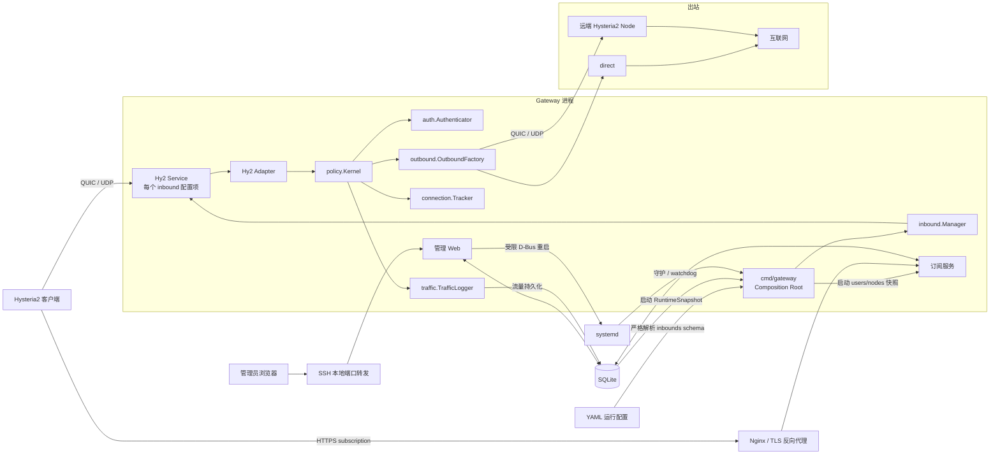
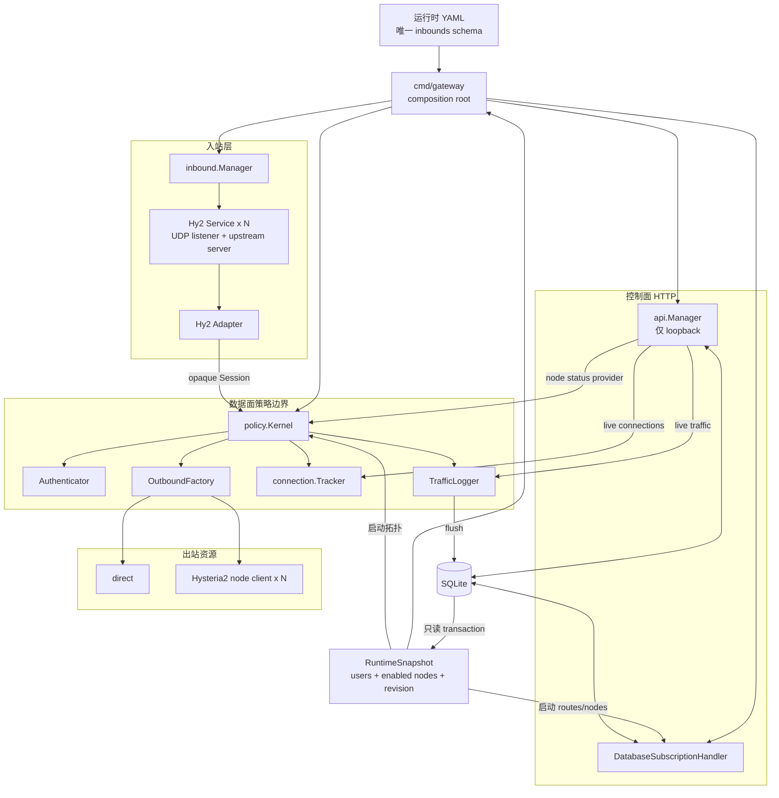
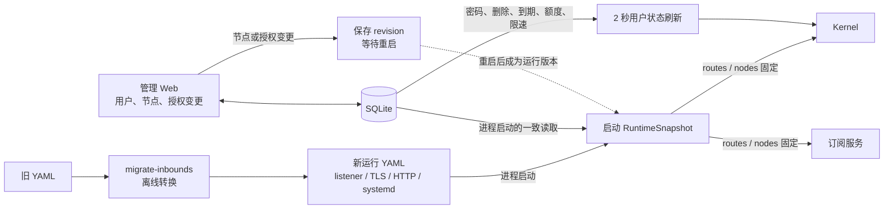
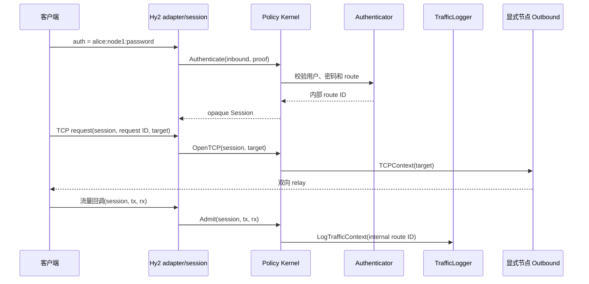

# Proxy Gateway 架构设计

## 系统边界

Proxy Gateway 在 Hysteria2 核心库之上实现多用户入口、显式节点路由、流量策略和 SQLite 控制面。生产数据面由协议无关的 `policy.Kernel` 收口：入站协议只能取得 Kernel 创建的不透明 session，不能自行选择出站或按任意用户 ID 记账。

Gateway、本地管理 Web、公开订阅 HTTP 服务、重启调度器和 watchdog 都运行在同一进程中；systemd 负责进程守护和异常重启。



监听由 `inbounds` 列表和两个可选 HTTP 服务定义：

- 每个 `inbounds[].listen` 是一个具名 Hysteria2 QUIC/UDP 入口。
- `admin.listen` 是仅本机访问的管理 HTTP/TCP 入口。
- `sub.listen` 是可由 Nginx 发布到公网的订阅 HTTP/TCP 入口。

`inbound.Manager` 只管理协议 listener 的 `Start`、`Close` 和 `Wait`，不拥有配置、SQLite、策略或出站资源。Gateway 在启动任一 serve loop 前先完成所有 HTTP 和 UDP listener 的构造；构造失败时关闭此前已取得的 listener。

## 运行时所有权

下图说明进程内的依赖方向和资源所有权。`cmd/gateway` 是唯一 composition root：它读取配置、打开 SQLite、取得一致的启动快照，并构造 HTTP 服务、入站服务和 Kernel。入站层不依赖 SQLite 或出站实现；协议适配器也不能绕过 Kernel 取得 route ID 或 Outbound。



`Hy2 Service` 在构造时绑定 UDP socket、创建上游 Hysteria2 server 和其 adapter；因此 `inbound.Manager` 接手的是已构造的 listener，而不是配置描述。`OutboundFactory` 由 Kernel 独占，并负责 direct dialer 及共享 Hysteria2 node client 的预热、重连和关闭。

## 配置与运行状态

YAML 与 SQLite 的职责不同。YAML 只决定进程和 listener 的静态形状；SQLite 是管理数据的持久化来源。启动快照固定路由拓扑，运行中仅允许用户生命周期字段刷新，避免管理端刚保存的节点或授权提前进入数据面。



`migrate`（管理数据导入）、`migrate-inbounds`（旧运行 YAML 转换）和 `validate-inbounds`（新运行 YAML 校验）都是独立可执行程序，不是 Gateway 的运行时子命令或请求路径。

## 配置来源

运行时 YAML 只接受唯一的 `inbounds` schema，保存启动前必须知道的参数：UDP/TLS/QUIC、每个入站的协议选项（Hysteria2 的 `masquerade`、Trojan 的握手与 UDP 上限）、管理和订阅监听、SQLite 路径、自然月时区、流量 flush 周期和 systemd 设置。顶层旧字段 `listen`、`quic`、`api`、`users`、`nodes`、`obfs` 和 `masquerade` 不属于运行时 schema，会被严格解析拒绝；`masquerade` 已改为 `inbounds[].masquerade`。TLS 使用已有的证书和私钥文件，证书签发与续期由外部工具完成。

SQLite 保存：

- 用户密码、软删除、到期时间、月额度、下载限速和订阅 token 哈希。
- 节点定义、启用状态和用户节点授权。
- 配置 revision、流量明细与汇总、重启任务和进程运行历史。

进程启动时在一个只读 SQLite transaction 中读取用户、授权、启用节点和 revision，得到 `RuntimeSnapshot`。Kernel、订阅服务和进程运行记录都使用该启动快照；不会将用户、节点和 revision 的混合状态标记为同一运行版本。

节点定义及用户节点授权修改后增加保存 revision，必须重启才能成为运行 revision。用户密码、软删除、到期、额度和限速每 2 秒从 SQLite 刷新；Kernel 用启动时的 routes 覆盖刷新结果，因此新用户、节点或授权在重启前不会提前获得运行权限。

旧 YAML 的 `users`、`nodes`、`sub.secret` 和 `api.secret` 仅供独立 `migrate` 可执行程序读取。`migrate-inbounds` 负责把不含管理数据的旧运行参数转换为新 schema；两种迁移都不属于 Gateway 正常运行路径。

## 认证与路由

客户端 auth 格式为：

```text
username:node:password
```

第一个冒号前是用户名，第二段是客户端明确选择的节点，剩余内容是密码，因此密码可以包含冒号。Authenticator 同时检查用户状态、到期时间、密码和节点授权。认证通过后的 `username:node` route ID 仅保留在 Kernel 私有的 `policy.Session` 中。

Hy2 adapter 在认证成功时取得 Kernel 创建的私有 session。每次 TCP/UDP 请求都由上游携带该 session 和稳定 request ID 回调 adapter；adapter 只能将 session 和目标交给 Kernel，不使用 event callback、channel、按目标匹配或公开 route ID 交接身份。



路由采用 fail-closed：session 类型无效、跨 Kernel session、节点不存在或拨号失败都直接报错。服务端不会替换为 `direct`，也不会自动选择其他节点。客户端可在订阅中拿到多个获授权的代理条目，并在客户端侧配置选择或故障切换。

## 出站生命周期

Kernel 持有 `OutboundFactory`，后者持有启动时加载的 Hysteria2 节点定义；`direct` 是唯一内建出站。`Outbound` 强制提供 `TCPContext` 和 `UDPContext`，因此请求取消必须沿出站边界传播。Gateway 启动时最多并发预连接 8 个节点，并等待首轮连接结果最多 10 秒。一个节点阻塞或失败不会占用全局锁，也不会阻止其他节点完成连接；预热超时后 Gateway 继续启动，未完成节点留在后台处理。

每个节点在 Ready 状态持有一个上游 `client.Client` 并复用 QUIC stream。连接关闭后立即将该节点标记为不可用，请求直接失败，不在请求路径等待重连；后台使用带 jitter 的指数退避重建连接，最长等待 60 秒。每次后台连接尝试均以 3 秒超时重新解析域名，依次尝试返回的 A/AAAA 地址，同时保留原域名作为默认 SNI；IPv4/IPv6 字面量跳过 DNS。Direct TCP 拨号超时为 10 秒，Hy2 握手使用上游默认 5 秒。

节点状态为 Connecting、Ready、Unavailable 或 Backoff，管理后台同时展示解析地址、最近成功、最近错误和下次重试时间。单个 UDP association 的正常本地关闭不会将共享 node client 标记为不可用；仅连接级失败触发后台重连。Gateway 停机时停止所有节点 worker 并关闭活动 client。这不是多连接池，当前一个 Hysteria2 节点对应一条活动 client 连接。

## 流量、配额和连接

Hysteria2 将 session、`tx` 和 `rx` 交给 adapter；adapter 经 Kernel 将私有 route ID 交给共享 TrafficLogger。Gateway 按 `username + node` 维护内存累计值，定期把增量写入 `traffic_logs` 并更新 `traffic_summary`。Authenticator 与 TrafficLogger 读取同一个用户策略发布源，避免认证和计量保留独立的热更新用户表。

- `tx`：客户端经 Gateway 发往 Node 或目标。
- `rx`：Node 或目标经 Gateway 发往客户端。
- 用户自然月额度：该用户所有节点的 `tx + rx`。
- 用户下载限速：该用户所有连接共享的 `rx` 令牌桶。

数据库时间统一为 UTC Unix 秒；自然月边界按 YAML `timezone` 换算到 UTC 查询。异常退出最多损失一个 flush 周期的内存增量。

停用、到期或超额后，Authenticator 拒绝新连接；TrafficLogger 在已有会话产生下一笔流量时、转发和计量该有效负载之前返回 false，使 Hysteria2 关闭整条客户端 QUIC 连接。完全空闲的会话不会被主动清理，可能继续出现在活跃连接中，直到客户端断开、再次产生流量、QUIC idle timeout 或 Gateway 重启；当前上游 server API 没有暴露按用户关闭空闲 QUIC 连接的句柄。密码重置只影响后续认证。

adapter 的 session/request 回调维护内存中的连接和目标快照，管理后台的 `/live` 每 2 秒读取该快照。连接明细不持久化。

## 管理与订阅

管理 Web 使用服务端模板和表单，不提供通用管理 JSON API。`/live` 和 `/traffic-range` 是同一后台页面使用的只读数据端点；写操作只能 POST，并要求进程启动时生成的 CSRF token。为兼容 SSH 和本地反向代理，不依赖容易误判的 Origin/Referer 校验。后台没有登录鉴权，因此监听地址会被强制校验为 loopback。

订阅服务是独立 handler。URL token 是 bearer credential：新 token 随机生成，数据库只保存 SHA-256 哈希；重置后旧链接立即失效。订阅从数据库读取用户当前密码和生命周期状态，但只下发进程启动时已加载的节点与授权快照，防止待重启配置提前暴露。`sub.inbound` 显式绑定生成订阅所使用的 Hysteria2 入口。配置通过 `yaml.v3` 结构化编码，所有数据库和 YAML 来源的字符串均按 YAML 标量转义。

`sub.publicURL` 只决定后台展示的订阅 URL，`sub.serverAddr` 决定生成配置中每个 Hysteria2 代理连接的 Gateway 地址。所有代理都先连接 Gateway，不会把远端 Node 地址直接发给用户。

## systemd 与停机

后台通过 godbus 调用 systemd D-Bus，只请求 YAML 中固定 unit 的重启，不执行 shell 命令。计划任务存入 SQLite；调度器每 5 秒领取到期任务。成功接受的任务会关联下一条进程运行记录，失败任务保留原始 D-Bus 错误；watchdog/OOM/信号等恢复启动从上一进程的 systemd result 推导。

启用 watchdog 时，应用仅在 Gateway serve loop 正常且 SQLite `Ping` 成功时发送心跳。Node 不可用不会触发整个 Gateway 重启。`ExecStopPost` 使用轻量的 `record-exit` 子命令写入 systemd 的 `SERVICE_RESULT`、`EXIT_CODE` 和 `EXIT_STATUS`，供故障分析页面展示。

收到 SIGINT/SIGTERM 后，进程依次停止新流量准入、后台刷新和调度，通过 `inbound.Manager` 关闭并等待所有 QUIC server，关闭 HTTP server 和缓存出站，最后 flush 流量并关闭 SQLite。worker 阶段预算为 12 秒，整体停机预算为 15 秒，systemd 的 `TimeoutStopSec` 应大于该预算。

## 模块

```text
cmd/gateway/          Gateway 进程入口、record-exit 和生命周期
cmd/migrate/          独立 legacy 管理数据迁移程序
cmd/migrate-inbounds/ 旧运行 YAML 到唯一 inbounds schema 的转换程序
cmd/validate-inbounds/ 新运行 YAML 的离线严格校验程序
internal/api/         管理 Web、静态资源和订阅 handler
internal/auth/        凭据解析、鉴权和用户策略发布
internal/config/      唯一运行 YAML schema 与旧 YAML 转换
internal/connection/  活跃连接和请求追踪
internal/inbound/     listener 生命周期 Manager
internal/inbound/hysteria2/ Hy2 Service、adapter 与上游库边界
internal/migration/   legacy 管理数据迁移编排
internal/outbound/    Direct、Hy2 node client、重试与连接资源管理
internal/policy/      认证 session、授权出站、账务和追踪的生产边界
internal/router/      遗留的显式 route helper；不在生产数据面调用
internal/storage/     SQLite schema、迁移和查询
internal/subtoken/    随机 token 与旧 HMAC token
internal/systemd/     D-Bus 和 sd_notify
internal/traffic/     计量、配额、限速和 flush
test/integration/     组件集成测试
test/e2e/             真实 Hysteria2 请求链路测试
```

## 关键约束

- Hysteria2 上游若改变 session/request callback 或取消语义，必须重新验证 adapter 的身份、计量和关闭边界。
- SQLite 是单实例控制面，不支持多个 Gateway 进程共享运行配置。
- 节点和授权不是热更新，后台必须清楚展示保存 revision 与运行 revision。
- 用户热刷新只更新启动快照中已有用户的密码、生命周期和限额；不会在重启前接受新用户或新的 route。
- `direct` 是特殊的显式节点，不存入 `managed_nodes`。
- Gateway 和 Node 的成本值都是有效负载估算，不含协议开销和重传。
