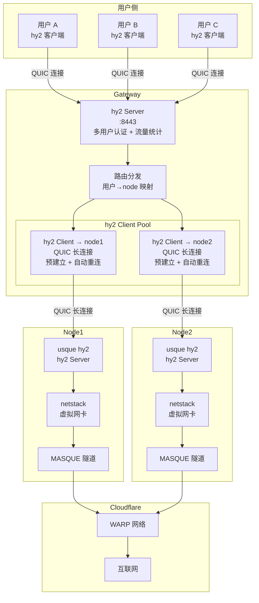
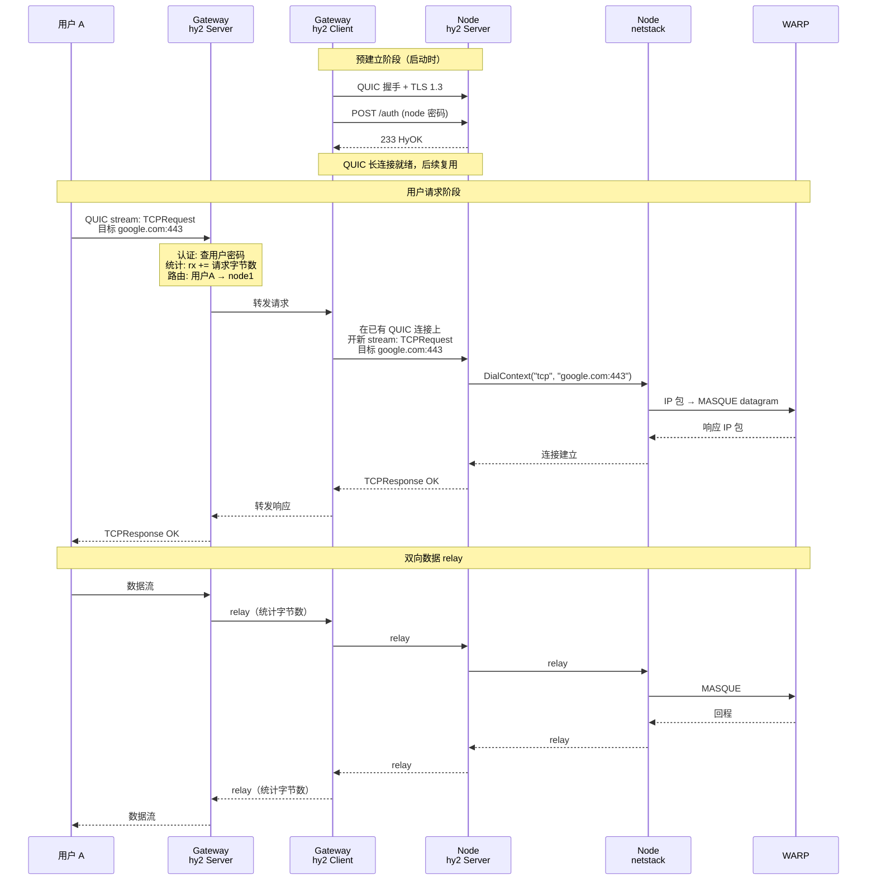

# Hy2-Gateway 架构设计

## 概述

Hy2-Gateway 是一个基于 Hysteria2 协议的网关服务，在 Hysteria2 核心库之上构建，
实现按用户名路由、鉴权和流量统计等业务功能。

不修改 Hysteria2 源码，而是通过实现其暴露的接口（Authenticator / Outbound / TrafficLogger / EventLogger）注入业务逻辑。

## 整体架构



## TCP 数据流



## Gateway 内部组件

```
┌──────────────────────────────────────────────────────┐
│                   Hy2-Gateway                        │
│                                                      │
│  ┌──────────────┐  ┌───────────────┐  ┌───────────┐ │
│  │ Authenticator │  │ TrafficLogger │  │ EventLogger│ │
│  │ 用户鉴权      │  │ 流量统计+配额  │  │ 上下文桥接 │ │
│  └──────┬───────┘  └───────┬───────┘  └─────┬─────┘ │
│         │                  │                │       │
│  ┌──────▼──────────────────▼────────────────▼─────┐ │
│  │              RoutingOutbound                    │ │
│  │         按用户名选择出站策略                      │ │
│  └──────┬──────────────┬──────────────┬───────────┘ │
│         │              │              │             │
│  ┌──────▼─────┐ ┌──────▼─────┐ ┌─────▼──────┐     │
│  │  Direct    │ │ SOCKS5/HTTP│ │ hy2 Client │     │
│  │  直连出站   │ │ 代理出站    │ │ Pool       │     │
│  └────────────┘ └────────────┘ │ 预建立+重连  │     │
│                                └─────────────┘     │
│                                                      │
│  ┌──────────────┐  ┌───────────────┐                │
│  │ SQLite Store │  │ Management API│                │
│  │ 流量持久化    │  │ :9090         │                │
│  └──────────────┘  └───────────────┘                │
└──────────────────────────────────────────────────────┘
```

## Hysteria2 核心接口

### 1. Authenticator

```go
type Authenticator interface {
    Authenticate(addr net.Addr, auth string, tx uint64) (ok bool, id string)
}
```

- 客户端连接时调用
- `auth` 字段格式为 `username:password`（userpass 模式）
- 返回 `ok` 表示是否通过认证，`id` 作为用户标识贯穿整个连接生命周期

### 2. Outbound

```go
type Outbound interface {
    TCP(reqAddr string) (net.Conn, error)
    UDP(reqAddr string) (UDPConn, error)
}
```

- 每个代理请求都会调用此接口建立到目标的连接
- **关键限制**：原生 Outbound 接口不携带用户信息

### 3. TrafficLogger

```go
type TrafficLogger interface {
    LogTraffic(id string, tx, rx uint64) (ok bool)
    LogOnlineState(id string, online bool)
    TraceStream(stream HyStream, stats *StreamStats)
    UntraceStream(stream HyStream)
}
```

- `id` 就是 Authenticator 返回的用户标识
- `LogTraffic` 返回 false 可以断开用户连接（用于限流/封禁）
- `TraceStream`/`UntraceStream` 用于 stream 级别的追踪

### 4. EventLogger

```go
type EventLogger interface {
    Connect(addr net.Addr, id string, tx uint64)
    Disconnect(addr net.Addr, id string, err error)
    TCPRequest(addr net.Addr, id, reqAddr string)
    TCPError(addr net.Addr, id, reqAddr string, err error)
    UDPRequest(addr net.Addr, id string, sessionID uint32, reqAddr string)
    UDPError(addr net.Addr, id string, sessionID uint32, err error)
}
```

## 按用户路由的实现

### 问题

Hysteria2 的 `Outbound` 接口只接收 `reqAddr`（目标地址），不携带用户信息。
在 Outbound 层面无法直接知道当前请求属于哪个用户。

### 解决方案：EventLogger 时序桥接

通过阅读 Hysteria2 源码（`server.go` 的 `handleTCPRequest`），确认了关键时序：

```
EventLogger.TCPRequest(addr, id, reqAddr)   ← 先调用，携带用户 ID
Outbound.TCP(reqAddr)                        ← 后调用，不携带用户 ID
```

利用这个时序，在 `EventLogger.TCPRequest` 中将 `(addr, reqAddr) → userId` 写入并发安全的映射，
然后在 `RoutingOutbound.TCP` 中查找该映射获取用户 ID，再根据用户的路由配置选择对应的出站。

```
Connect(addr, id="alice")
  → connCtx[addr] = "alice"

TCPRequest(addr, id="alice", reqAddr="google.com:443")
  → requestCtx[addr+"->"+reqAddr] = "alice"

Outbound.TCP("google.com:443")
  → 查 requestCtx 得到 "alice"
  → 查路由表: alice → node1
  → 通过 hy2 Client Pool 中 node1 的长连接转发
```

### hy2 Client Pool 设计要点

- **预建立**：Gateway 启动时即与所有配置的 node 建立 QUIC 长连接
- **自动重连**：使用 hysteria2 client 库的 `ReconnectableClient`，断线自动恢复
- **Stream 复用**：每个用户请求在已有 QUIC 连接上开新 stream，无需重新握手
- **连接池化**：同一个 node 可以维护多条 QUIC 连接以提高并发吞吐

## 模块划分

```
hy2-gateway/
├── cmd/
│   └── gateway/              # 入口
│       └── main.go
├── internal/
│   ├── config/               # 配置解析
│   │   └── config.go
│   ├── auth/                 # 鉴权模块
│   │   └── authenticator.go
│   ├── router/               # 路由模块
│   │   ├── router.go         # 路由决策引擎
│   │   ├── outbound.go       # RoutingOutbound（核心）
│   │   ├── direct.go         # 直连出站
│   │   ├── socks5.go         # SOCKS5 代理出站
│   │   ├── http.go           # HTTP CONNECT 代理出站
│   │   └── hysteria2.go      # hy2 客户端出站
│   ├── traffic/              # 流量统计
│   │   └── logger.go
│   ├── storage/              # 持久化
│   │   └── sqlite.go
│   ├── event/                # 事件日志
│   │   └── logger.go
│   └── api/                  # 管理 API
│       └── server.go
├── test/
│   ├── integration/          # 组件级集成测试
│   │   └── e2e_test.go
│   └── e2e/                  # 真实 hy2 客户端连通测试
│       └── hy2_e2e_test.go
├── configs/
│   └── gateway.yaml          # 示例配置
├── docs/
│   ├── ARCHITECTURE.md       # 本文档
│   ├── INTEGRATION.md        # Hysteria2 核心库集成指南
│   └── ROADMAP.md            # 开发路线图
├── Dockerfile
├── Makefile
├── go.mod
└── go.sum
```

## 配置设计

```yaml
listen: :8443

tls:
  cert: /path/to/cert.pem
  key: /path/to/key.pem

users:
  alice:
    password: "alice_pass"
    route: "node1"              # 路由到 node1
    maxBytes: 107374182400      # 100GB 流量限制
  bob:
    password: "bob_pass"
    route: "node2"              # 路由到 node2
    maxBytes: 0                 # 不限流量
  charlie:
    password: "charlie_pass"
    route: "direct"             # 直连出站

nodes:
  node1:
    type: hysteria2
    hysteria2:
      addr: "node1.example.com:443"
      auth: "node1_auth_string"
  node2:
    type: hysteria2
    hysteria2:
      addr: "node2.example.com:443"
      auth: "node2_auth_string"

api:
  listen: ":9090"
  secret: "admin_secret"

dbPath: "hy2-gateway.db"
trafficFlushInterval: 10s
```
