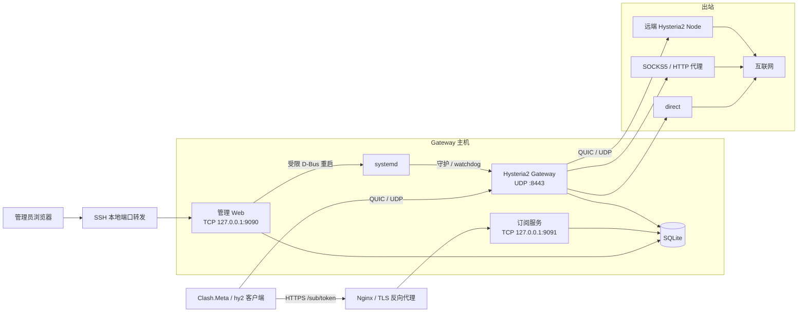
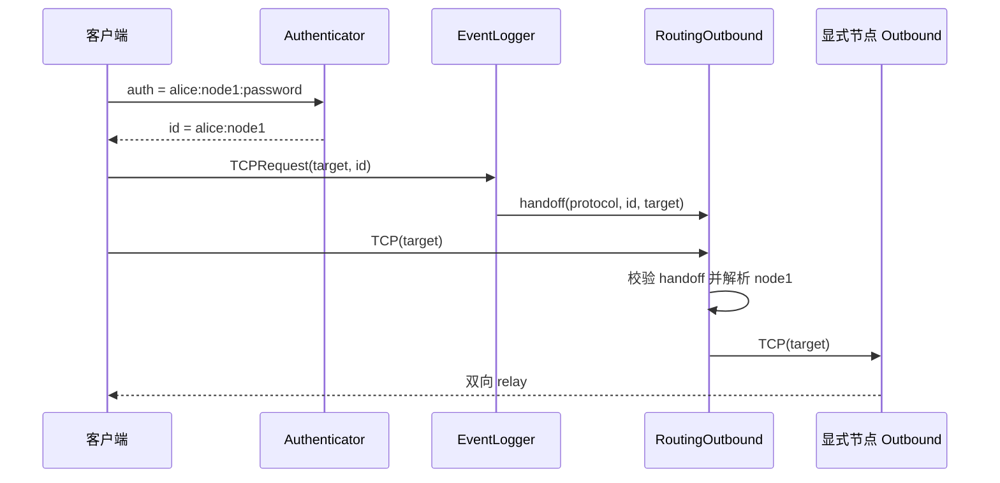

# Hy2-Gateway 架构设计

## 系统边界

Hy2-Gateway 在 Hysteria2 核心库之上实现多用户入口、显式节点路由、流量策略和 SQLite 控制面。Gateway、本地管理 Web、公开订阅 HTTP 服务、重启调度器和 watchdog 都运行在同一进程中；systemd 负责进程守护和异常重启。



三个监听端口互不复用：

- `listen` 是 Hysteria2 QUIC/UDP 入口。
- `admin.listen` 是仅本机访问的管理 HTTP/TCP 入口。
- `sub.listen` 是可由 Nginx 发布到公网的订阅 HTTP/TCP 入口。

## 配置来源

YAML 只保存启动前必须知道的参数：UDP/TLS/QUIC、管理和订阅监听、SQLite 路径、自然月时区、流量 flush 周期和 systemd 设置。TLS 使用已有的证书和私钥文件，证书签发与续期由外部工具完成。

SQLite 保存：

- 用户密码、软删除、到期时间、月额度、下载限速和订阅 token 哈希。
- 节点定义、启用状态和用户节点授权。
- 配置 revision、流量明细与汇总、重启任务和进程运行历史。

进程启动时读取用户、节点和授权快照。节点定义及用户节点授权修改后增加保存 revision，必须重启才能成为运行 revision。用户密码、软删除、到期、额度和限速每 2 秒从 SQLite 刷新；新建用户在重启前没有启动快照，因此也不会提前获得运行权限。

旧 YAML 的 `users`、`nodes`、`sub.secret` 和 `api.secret` 仅供显式 `migrate` 命令读取，不属于正常运行配置。

## 认证与路由

客户端 auth 格式为：

```text
username:node:password
```

第一个冒号前是用户名，第二段是客户端明确选择的节点，剩余内容是密码，因此密码可以包含冒号。Authenticator 同时检查用户状态、到期时间、密码和节点授权，成功后返回 `username:node` 作为连接 ID。

Hysteria2 的 `Outbound` 接口只携带目标地址，不携带连接 ID。上游当前调用顺序是：

```text
EventLogger.TCPRequest(addr, id, target)
Outbound.TCP(target)
```

UDP 请求也遵循对应顺序。EventLogger 将 `{protocol, id, target}` 放入容量为 1 的 channel，紧随其后的 RoutingOutbound 取出并校验协议和目标，再从 ID 解析节点。这个短交接段会串行化，实际拨号和数据转发仍然并发。



路由采用 fail-closed：上下文缺失或错配、ID 缺少节点、节点不存在、节点未授权或拨号失败都直接报错。服务端不会替换为 `direct`，也不会自动选择其他节点。客户端可在订阅中拿到多个获授权的代理条目，并在客户端侧配置选择或故障切换。

## 出站生命周期

`OutboundFactory` 持有启动时加载的节点定义，并按需创建、缓存每个节点的一个 outbound：

- `direct`、SOCKS5 和 HTTP CONNECT 在第一次使用时创建。
- Hysteria2 outbound 也在第一次使用该节点时创建；创建时其 `ReconnectableClient` 立即建立一条 QUIC 连接，之后自动重连并复用 stream。
- Gateway 停机时关闭所有已缓存且支持关闭的 outbound。

这不是多连接池，也不会在 Gateway 启动时预连接全部节点。当前一个 Hysteria2 节点对应一个缓存 client。

## 流量、配额和连接

Hysteria2 将认证 ID、`tx` 和 `rx` 交给 TrafficLogger。Gateway 按 `username + node` 维护内存累计值，定期把增量写入 `traffic_logs` 并更新 `traffic_summary`。

- `tx`：客户端经 Gateway 发往 Node 或目标。
- `rx`：Node 或目标经 Gateway 发往客户端。
- 用户自然月额度：该用户所有节点的 `tx + rx`。
- 用户下载限速：该用户所有连接共享的 `rx` 令牌桶。

数据库时间统一为 UTC Unix 秒；自然月边界按 YAML `timezone` 换算到 UTC 查询。异常退出最多损失一个 flush 周期的内存增量。

停用、到期或超额后，Authenticator 拒绝新连接；TrafficLogger 在已有会话产生下一笔流量时、转发和计量该有效负载之前返回 false，使 Hysteria2 关闭整条客户端 QUIC 连接。完全空闲的会话不会被主动清理，可能继续出现在活跃连接中，直到客户端断开、再次产生流量、QUIC idle timeout 或 Gateway 重启；当前上游 server API 没有暴露按用户关闭空闲 QUIC 连接的句柄。密码重置只影响后续认证。

`TraceStream`、`UntraceStream` 与 EventLogger 共同维护内存中的连接和目标快照，管理后台的 `/live` 每 2 秒读取该快照。连接明细不持久化。

## 管理与订阅

管理 Web 使用服务端模板和表单，不提供通用管理 JSON API。`/live` 和 `/traffic-range` 是同一后台页面使用的只读数据端点；写操作只能 POST，并要求进程启动时生成的 CSRF token。为兼容 SSH 和本地反向代理，不依赖容易误判的 Origin/Referer 校验。后台没有登录鉴权，因此监听地址会被强制校验为 loopback。

订阅服务是独立 handler。URL token 是 bearer credential：新 token 随机生成，数据库只保存 SHA-256 哈希；重置后旧链接立即失效。订阅从数据库读取用户当前密码和生命周期状态，但只下发进程启动时已加载的节点与授权快照，防止待重启配置提前暴露。配置通过 `yaml.v3` 结构化编码，所有数据库和 YAML 来源的字符串均按 YAML 标量转义。

`sub.publicURL` 只决定后台展示的订阅 URL，`sub.serverAddr` 决定生成配置中每个 Hysteria2 代理连接的 Gateway 地址。所有代理都先连接 Gateway，不会把远端 Node 地址直接发给用户。

## systemd 与停机

后台通过 godbus 调用 systemd D-Bus，只请求 YAML 中固定 unit 的重启，不执行 shell 命令。计划任务存入 SQLite；调度器每 5 秒领取到期任务。成功接受的任务会关联下一条进程运行记录，失败任务保留原始 D-Bus 错误；watchdog/OOM/信号等恢复启动从上一进程的 systemd result 推导。

启用 watchdog 时，应用仅在 Gateway serve loop 正常且 SQLite `Ping` 成功时发送心跳。Node 不可用不会触发整个 Gateway 重启。`ExecStopPost` 使用轻量的 `record-exit` 子命令写入 systemd 的 `SERVICE_RESULT`、`EXIT_CODE` 和 `EXIT_STATUS`，供故障分析页面展示。

收到 SIGINT/SIGTERM 后，进程依次停止后台刷新和调度、关闭两个 HTTP server、关闭 QUIC server、关闭缓存出站、flush 流量并关闭 SQLite。systemd 的 `TimeoutStopSec` 应大于应用内部关闭宽限时间。

## 模块

```text
cmd/gateway/          进程入口、migrate、record-exit 和生命周期
internal/api/         管理 Web、静态资源和订阅 handler
internal/auth/        auth 解析、鉴权和用户快照更新
internal/config/      启动 YAML 与旧 YAML 类型
internal/connection/  活跃连接和请求追踪
internal/event/       上游事件和请求上下文交接
internal/router/      路由决策、出站工厂与出站实现
internal/storage/     SQLite schema、迁移和查询
internal/subtoken/    随机 token 与旧 HMAC token
internal/systemd/     D-Bus 和 sd_notify
internal/traffic/     计量、配额、限速和 flush
test/integration/     组件集成测试
test/e2e/             真实 Hysteria2 请求链路测试
```

## 关键约束

- Hysteria2 上游若改变 EventLogger 与 Outbound 的调用时序，必须重新验证上下文交接。
- SQLite 是单实例控制面，不支持多个 Gateway 进程共享运行配置。
- 节点和授权不是热更新，后台必须清楚展示保存 revision 与运行 revision。
- `direct` 是特殊的显式节点，不存入 `managed_nodes`。
- Gateway 和 Node 的成本值都是有效负载估算，不含协议开销和重传。
