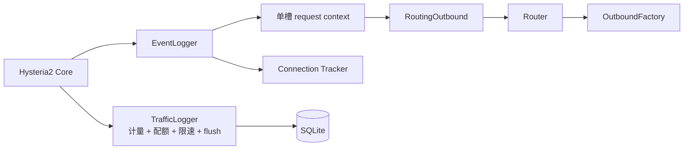
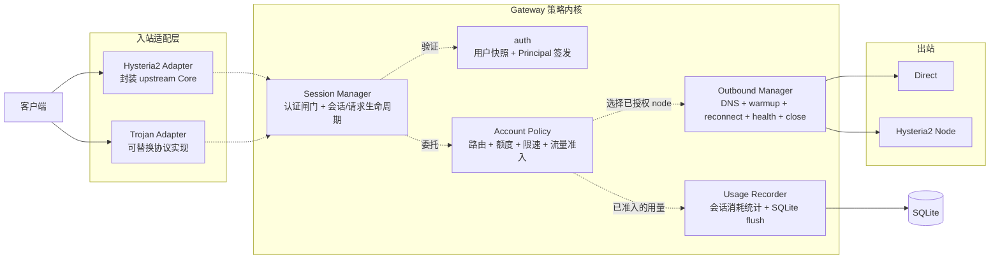

# 入站协议与策略内核重构提案

状态：Draft

基线：`master@99f4ce46f155878f6ad0d58e2a26de0078a45ba1`

参考实现：`9b93d1045fc3e9e0c1c5add97471b08b12d9acdf`（不作为分支依赖，不整笔 cherry-pick）

目标分支：`refactor/inbound-policy-kernel`

## 结论

Gateway 应从“程序本身就是 Hysteria2 服务”重构为“协议适配器 + 统一策略内核”。协议适配器只处理 wire protocol、握手和逻辑会话；用户生命周期、节点授权、出站选择、配额、限速、计量、连接追踪和停机由共享内核负责。

核心重构先只迁移 master 已有的 Hysteria2 行为，不以 Trojan 功能作为重构完成条件。核心完成后，再参考 `9b93d10` 的协议代码和测试，通过新 adapter 边界分别交付 Trojan TCP、UDP、mux 和 fallback。重构不得更改现有流量口径。

## 目标

- 建立可将 Hysteria2 和 Trojan 建模为同级入站协议的运行时结构。
- 让认证后的请求显式携带不可伪造的会话身份，不再让通用 router 依赖协议回调时序。
- 为 TCP 流和 UDP association 提供统一的出站、计量、限速和取消边界。
- 保持现有 `username:node` 身份、显式节点选择、fail-closed 路由和 SQLite 口径。
- 只接受新的 `inbounds` YAML schema；提供一次性旧 YAML 迁移命令，不在运行时保留兼容分支。
- 为成熟 Trojan 实现建立可验证的适配条件，而不是默认任何独立 Trojan 服务都能直接嵌入。
- 允许按小 PR 迁移，每一步都能独立回归和回滚。

## 非目标

- 核心重构不直接实现 Trojan TCP、UDP ASSOCIATE、mux、BIND 或 fallback。
- 不在本次重构中引入多 Gateway 共享 SQLite。
- 不改变节点自动故障切换策略；服务端仍不隐式回退到 `direct`。
- 不改变用户、新节点和授权的重启生效规则。
- 不为了统一接口抹平 QUIC、TCP、UDP association 和 mux stream 的不同生命周期。
- 不直接复制 GPL 实现代码；引入第三方实现前必须单独确认版本、许可证和维护状态。

## 改动前架构

master 当前只有 Hysteria2 入站，并且其协议边界直接贯穿认证、路由、流量和进程生命周期。



`9b93d10` 通过新增一条直接调用 Router、OutboundFactory、TrafficLogger 和 Tracker 的 Trojan 路径证明了功能可行，也暴露出共享层尚未形成稳定入站边界。该提交只作为需求、协议和测试参考；本分支不继承其中混合的配置、订阅、流量和构建改动。

### `9b93d10` 正确性修复基线

本重构必须包含 `9b93d10` 中所有已经确认的正确性和安全性修复，不能只挑选
traffic 改动。合入顺序仍应与协议 adapter 解耦：每项先在 `master` 写出失败用例，
再以最小修复单独合入；不能因为它最初和 Trojan 一起提交，就把它当作 Trojan
专属行为。

当前已识别、应进入重构前基线的项目包括：

| 范围 | 修复目标 |
|---|---|
| 流量与账务 | 跨自然月的 pending 流量按原月份持久化；flush 失败完整恢复且不重复记账；无法加载额度基线时 fail closed；汇总时间戳不被迟到 batch 回退。 |
| 流量生命周期 | 限速等待可被 request context、用户策略变更和进程停机取消；已取消 chunk 不计量；停机开始后拒绝新流量，最终 flush 不丢失已计量流量。 |
| 拨号与停机 | direct TCP 拨号接受 context；关闭顺序可取消协议 handler 的拨号和限速等待，避免卡在超时或形成互相等待。 |
| 配置与节点快照 | 已禁用的 managed node 不进入启动时出站快照；用户热更新复用同一份“保留启动时授权、更新生命周期字段”的快照规则。 |
| 本地控制面安全 | 管理页面和其 JSON 运行态端点返回 `Cache-Control: no-store`，避免浏览器或中间缓存保存用户、连接和订阅相关数据。 |

订阅生成、Docker/CI、版本信息和 Trojan 协议实现等变更不因位于同一 PR 而自动
成为“bugfix”；它们仍按各自需求单独评审。若在逐项复现时发现上表遗漏了
`9b93d10` 的确切错误修复，应补充失败测试和基线条目，而不是留到 adapter PR。

### 扩展时暴露的耦合

| 领域 | 当前行为 | 扩展问题 |
|---|---|---|
| 配置 | master 顶层 `listen`/`quic` 隐式表示 Hy2；增量 PR 只能再增加顶层 `trojan` 特例 | 入站协议不是同级模型，继续增加协议会堆叠特例 |
| 身份传递 | Hy2 通过 EventLogger 与 Outbound 的调用顺序交接 ID；`9b93d10` 的 Trojan 路径直接传 ID | 通用 router 知道 Hy2 的时序限制，协议边界泄漏到共享层 |
| 流量策略 | master 的 `TrafficLogger` 面向 Hy2 回调；`9b93d10` 又加入取消、停机和 TCP relay 需求 | 新协议会迫使 logger 同时承担更多策略和生命周期职责 |
| TCP 拨号 | master 只有上游 `Outbound.TCP`；`9b93d10` 对具体 outbound 做类型断言获取 context | 取消能力不是统一契约 |
| UDP | 只存在于 Hy2 上游回调和 `server.UDPConn` 接口中 | Trojan UDP 无明确 association、包计量和超时边界 |
| mux | master 没有物理连接与逻辑请求分层 | 引入逻辑流后，物理连接与计费/追踪会话不再一一对应 |
| 生命周期 | `main` 直接构造和关闭 Hy2 server；增量 PR 继续追加具体 server 分支 | 每新增入站都要修改主函数并重新证明停机顺序 |

### 模块职责与迁移对照

下表以 `master` 的实际代码为基线。重构不是按目录一对一移动：部分
Hy2 专用实现应收敛到 adapter，`TrafficLogger` 的两个职责应拆开；控制面
和持久化层则基本保留。

| 改动前模块 | 当前职责 | 改动后归属 | 迁移方式和边界 |
|---|---|---|---|
| `cmd/gateway/main.go` | 组装所有组件；创建 UDP listener；直接构造、服务和关闭 Hy2 server | composition root + `inbound.Manager` | 不引入泛化的 `Runtime` 层。`main` 仍是组装点；`inbound.Manager` 只管理多个入站的 `Start`/`Close`/`Wait` 和错误汇聚，不拥有配置、策略或数据。 |
| `internal/config` | 顶层 `listen`/`quic` 隐式代表 Hy2 入站 | 唯一的 `inbounds` schema | 新版本启动时只解析新 schema。旧 YAML 由显式迁移命令改写为新文件，运行时不判断旧字段、不发弃用警告。 |
| `auth.Authenticator` | 实现 Hy2 `Authenticator`；校验密码、用户状态和节点授权；返回 `username:node` | `auth` 共享快照 + `Principal` 签发 | 不新增 resolver 服务。Hy2/Trojan adapter 各自保留协议凭据的解析和上游接口签名；共享 `auth` 包验证用户状态和路由授权，并签发不允许 adapter 伪造的 principal。 |
| `event.EventLogger` | 接收 Hy2 连接/请求事件；将身份交接给 `RoutingOutbound`；驱动连接追踪 | Hy2 adapter 内部 event bridge + `SessionManager` | Hy2 的“事件先于 Outbound”时序只能留在 adapter 内，不能成为共享 router 的调用前提。 |
| `router.RoutingOutbound` | 实现 Hy2 `Outbound`；从单槽 channel 取得身份并选择实际出站 | 删除；由 Hy2 adapter 私有 `outboundBridge` 替代 | 最终删除该公共 router 类型。Hy2 upstream 仍要求 `server.Outbound`，因此 adapter 内部保留最小桥接及必要的时序交接，但它只进入 `SessionManager` 的会话/policy 路径，不再暴露给其他协议。 |
| `router.Router` | 从已认证 ID `username:node` 解析 node 名称 | `Account Policy` 的显式节点选择 | 新接口接收 `auth` 签发的可信 `Session.Principal`；adapter 不得自行构造身份或绕过节点授权。 |
| `router.OutboundFactory` | 管理 direct/远端 Hy2 node，负责 DNS、建连、重连和节点状态 | `OutboundManager` | 保留其进程级资源所有权，明确负责 DNS、warmup、重连、健康状态、TCP/UDP flow 打开和 `Close`；对外不再暴露 Hy2 `server.Outbound`。 |
| `router.DirectOutbound` | 直接 TCP/UDP 连接 | `Direct` outbound | 保持出站角色；增加 context-aware TCP 和独立的 packet-flow UDP 契约，支持取消和统一停机。 |
| `router.Hysteria2Outbound` | 通过到远端 Hy2 node 的连接转发 TCP/UDP | `Hysteria2Node` outbound | 仍是出站实现；它与本机 Hy2 入站是不同角色，不能因为都使用 Hy2 而合并。 |
| `traffic.TrafficLogger` | Hy2 `TrafficLogger` 适配；在线数、限速、额度、月度统计、内存聚合和 SQLite flush | `Account Policy` + `UsageRecorder` | 前者决定某个 payload chunk/datagram 是否允许写出，后者观察并持久化已准入用量。额度判断和用量记录仍必须保持原子，不能引入“先放行、后计量”的窗口。Hy2 adapter 可保留一个窄 shim 来满足上游接口。 |
| `connection.Tracker` | 以客户端地址记录会话及 TCP/UDP 请求，供管理页显示 | `SessionManager` 的内部 registry | 改用 Gateway 生成的 session/request ID，避免地址复用歧义，并能表达 Trojan UDP association 与 mux 的逻辑流。管理 API 的现有输出字段保持兼容。 |
| `storage/sqlite.go` | 流量日志、汇总、SQLite 迁移 | `UsageRecorder` 的持久化实现 | 基本保留；协议 adapter 不得直接访问 SQLite。 |
| `storage/management.go` | 用户、节点、权限、配置版本和重启任务 | 控制面 repository | 基本保留；启动时提供认证和策略所需的启动快照。 |
| `api/*` | 管理页、订阅、读取连接/流量/存储状态 | 控制面 | 基本保留，改为读取 session 和 usage 的稳定接口，而不是协议 callback 的内部状态。 |
| `systemd/*` | 重启请求与 watchdog | 进程生命周期外围 | 不属于入站协议或策略内核，继续由 `main` 和 `inbound.Manager` 在进程级管理。 |

改造前的关键身份路径为：

```text
Hy2 Core
  -> Authenticator: 认证 username:node:password，返回 username:node
  -> EventLogger: 收到请求事件，将身份写入 RoutingOutbound 的单槽 channel
  -> RoutingOutbound -> Router -> OutboundFactory -> Direct / Hysteria2 outbound
```

流量和连接状态则通过另一组 Hy2 callback 并行进入 `TrafficLogger` 与
`Tracker`。因此同一个逻辑请求的身份、路由、计量和追踪由外部上游的
回调顺序间接关联。

改造后，两个入站的认证成功主路径应为：

```text
Hysteria2 Adapter / Trojan Adapter
  -> SessionManager
       -> auth: 共享用户快照 + Principal 签发
       -> 创建可信 Session { principal, protocol, sessionID }
       -> Account Policy: 路由、额度、限速、流量准入
       -> UsageRecorder: 会话消耗统计与 SQLite flush
       -> OutboundManager: 打开已选 node 的 TCP/UDP flow
       -> Direct / Hysteria2Node outbound
```

认证失败路径到此为止：adapter 拒绝协议连接，并只记录脱敏的认证失败日志或入站级
计数；不创建 `Session`，不调用 `SessionManager` 的会话或 policy 路径，也不产生用户
流量记录。认证成功后，`SessionManager` 才创建并登记 session；每一个后续请求才进入
出站与流量策略。

其中 adapter 只处理协议 wire format、握手和协议生命周期；`SessionManager` 管理已
认证会话并委托 `Account Policy` 选择逻辑出站和决定放行，再由 `OutboundManager` 管理
所选出站的实际资源与 flow。后一点对 Trojan UDP 尤其重要：
每个 datagram 都必须经过共享策略，不能因为 association 已建立而绕过禁用、到期、
额度或限速判断。

### `auth` 的职责边界

这里的 `auth` 是现有 `internal/auth` 包的收敛，不是新的通用认证框架、协议插件注册表
或独立运行时服务。它只回答一个问题：某段已经由协议 adapter 提取出来的认证材料，是否
代表一个当前有效且获授权的 `username:node`，若是则签发不透明的 `Principal`。

| `auth` 负责 | `auth` 不负责 |
|---|---|
| 保存由管理数据构建的只读用户/路由快照；验证用户存在、密码或 proof、禁用状态、到期和 node 授权；签发 `Principal`。 | TLS/QUIC、Trojan framing、认证报文解析、目标地址解析、拨号、流量额度/限速、会话追踪、SQLite 查询或 HTTP 管理操作。 |

Hy2 adapter 仍实现上游的 `Authenticator` 方法，Trojan adapter 仍处理 SHA-224 等协议
细节；二者将协议已解析的 proof 交给 `SessionManager`，由后者委托同一份 `auth` 快照
验证，不能自行返回 `username:node` 字符串或登记 session。
若未来协议需要新的 proof 形式，例如 mTLS subject 或签名 token，只在 `auth` 增加一个
针对该 proof 的窄验证入口和测试，不建立接收任意 `[]byte` 的通用 resolver 接口。该
入口必须明确证明到现有用户和 node 授权的映射。

### `9b93d10` 的拆分原则

| 类别 | 示例 | 本分支处理方式 |
|---|---|---|
| 共享正确性/安全性修复 | 跨月 pending、flush 失败恢复、可取消限速、停机最终 flush、context 拨号、禁用节点过滤、`no-store` | 全部先测试、再作为独立 PR 迁入；详见“正确性修复基线”。 |
| Trojan 协议资产 | parser、SHA-224 索引、TCP relay、协议 E2E | 等策略边界稳定后改造成 adapter，不直接 cherry-pick |
| 被替代的方案 | 顶层 `trojan` 配置、`main` 中具体 Trojan 分支 | 不迁入，由唯一 `inbounds` schema 和 `inbound.Manager` 取代 |
| 无关改动 | 订阅 header、节点迁移校验、Docker、CI 和文档清理 | 各自单独评审，不进入本次架构重构 |

## 改动后架构

目标架构保留一个进程和现有控制面，并在入站适配层之下提供共享策略内核。该图是
组件边界图：实线表示客户端可接入的入站，虚线表示组件使用关系。adapter 将协议已
解析的认证材料交给 `SessionManager`；它经 `auth` 成功认证后才创建 session 并使用
账户级 policy。图不表达认证分支、请求处理顺序或 TCP 字节流方向。



`SessionManager` 协调认证和会话生命周期，但不让未认证连接成为 session：认证失败时
直接拒绝，认证成功后才创建 session。单个 `Session` 可保存 principal、客户端信息、
request/association ID 和取消状态；它委托 `Account Policy` 选择出站并执行额度、限速
与流量准入。

`AccountPolicy` 和 `OutboundManager` 必须分开：前者依据 `Principal` 判断用户可使用的
逻辑 node（包括 `direct`）并实施账户级准入；后者拥有进程范围内的实际出站资源，负责
该 node 的 DNS、连接 warmup/重连、健康状态、TCP/UDP flow 打开及关闭。一个用户的
授权或流量耗尽不能重置共享 node 连接；反过来，一个 node 暂时不可用也不是 session
registry 的状态。adapter 不直接依赖 `OutboundManager`，只经由 `SessionManager` 和
`AccountPolicy` 取得被策略允许的 flow。

额度和限速不能放在单个 session 内，因为同一用户可能同时有多个 Hy2/Trojan 连接、
多个 node 和多个 mux stream；它们必须共享同一账户级状态。`UsageRecorder` 可以视为
session 消耗的 observer：它按 session ID 接收已准入的用量事件，聚合到用户/node 并
批量写 SQLite。但该 observer 必须同步参与准入记账，或与额度计数共享同一原子操作；
不能改成异步旁路，否则会出现“已放行但未计量”的窗口。

共享数据面不得 import 任何具体入站协议包；协议 adapter 可以依赖共享策略接口，但不能
直接访问 SQLite、管理后台或具体 outbound 类型。

### 共享契约不等于相同 adapter 逻辑

adapter 共享的是 Gateway 的产品语义，不是相同的协议业务实现。两者不应继承一个
“万能 adapter”基类；共用代码仅限于上图中的 `auth`、session、出站 policy 和流量
策略调用点。

| 领域 | 所有 adapter 必须保证的语义 | Hy2 adapter 的协议专属实现 | Trojan adapter 的协议专属实现 |
|---|---|---|---|
| 认证和会话 | 认证成功后才取得 `Principal` 并创建 session；失败不触碰 session、出站或流量策略 | 上游 `Authenticator`、`EventLogger` 回调顺序和 QUIC 连接事件桥接 | TLS accept、Trojan SHA-224 proof、握手超时和认证失败响应 |
| 请求和路由 | 每个 TCP 请求或 UDP association 经 `SessionManager` 委托的 `Account Policy` 选择已授权 node，并由 `OutboundManager` 打开 flow | 上游 `Outbound` bridge 与 `server.UDPConn` 适配 | CONNECT/UDP framing、目标地址解析、TCP half-close relay |
| 计量和限制 | 写出前 admission；按用户共享额度/限速；拒绝时不泄漏有效载荷 | 上游 `TrafficLogger` callback 到 `Account Policy` 的 shim | relay copy loop 中对双向 chunk/datagram 的显式 admission |
| 生命周期 | session/request 独立取消；Gateway 停机能停止 handler | QUIC server close、上游 stream/UDP session 生命周期 | TCP listener/connection close、TLS handshake、relay goroutine 收敛 |
| 可选能力 | 未实现时明确拒绝，不能伪装成已支持 | Hy2 上游定义的 UDP/QUIC 能力 | UDP ASSOCIATE、mux、fallback 各自的 framing、资源上限和客户端错误语义 |

新增协议同理：它可以没有 UDP 或 mux，也不需要模仿 Hy2/Trojan 的内部结构；只需在
自己的协议路径中兑现第一列的语义。若某项协议能力需要不同的资源模型或失败语义，
它应留在该 adapter，而不是扩散为共享 policy 的条件分支。

`inbound.Manager` 不是第二个业务 runtime，也不是 service locator。它只持有一组已
构造完成的入站，负责并发启动、收集 serve error、按确定顺序关闭并等待退出。引入它
的唯一原因是 Hy2 和 Trojan 同时运行后，`main` 不应为每种协议复制一套 goroutine、
错误通道和 shutdown 分支；若最终只有一个入站，它可以退化为很薄的一层甚至内联。

### 管理后台与控制面

管理后台继续是 loopback-only 的 server-rendered Web，不在本次重构中改成公开的
通用管理 API。SQLite 仍是用户、节点、授权、套餐、流量历史和重启任务的唯一持久化
来源；协议 adapter 既不读写 SQLite，也不接收来自 HTTP handler 的可变配置。

控制面和停机不进入上面的请求主链路：管理操作先写 SQLite，再由现有
`refreshUserState` 职责发布用户生命周期字段给 `auth` 和 `Account Policy`；节点和
授权只写 revision，重启后才加载新快照。停机时 `inbound.Manager` 停止接受新连接、
取消 handler/拨号/限速等待，等待退出后最终 flush usage，再关闭 `OutboundManager` 与 SQLite。

重构后 API 依赖三个窄的控制面/观测接口，而不是直接依赖 Hy2 callback 对象：

| 接口责任 | 提供者 | 管理后台用途 |
|---|---|---|
| 管理数据与变更 | management store / service | 用户、节点、授权、订阅 token、revision 和重启任务的读写。 |
| 运行态观测 | `SessionManager`、`UsageRecorder`、`OutboundManager`、`inbound.Manager` | `/live` 的会话/请求、累计流量、节点健康状态及每个入站的监听/错误状态。 |
| 生效状态 | policy snapshot publisher | 显示已保存 revision 与当前进程已加载 revision，区分立即生效和待重启的修改。 |

现有管理行为保持：密码、停用/到期、套餐额度和限速通过共享 policy snapshot 热更新；
节点定义和用户节点授权仍在重启后生效，因为它们决定 `OutboundManager` 和订阅目录的
启动快照。API 的 HTML、CSRF、loopback 约束、历史流量查询和现有 `/live` 输出字段
保持兼容；内部实现从 `TrafficLogger`/`Tracker` 具体类型改为上述稳定读模型。

## 核心契约草案

接口应从当前行为提取，避免先设计一个覆盖所有未来协议的宽接口。下面是方向性草案，不是最终 API。

```go
type Protocol string

const (
    ProtocolHysteria2 Protocol = "hysteria2"
    ProtocolTrojan    Protocol = "trojan"
)

type Session struct {
    ID         string // process-local opaque session ID
    Principal  auth.Principal // opaque; only auth package can create it
    Protocol   Protocol
    ClientAddr net.Addr
    StartedAt  time.Time
}

type AccountPolicy interface {
    DialTCP(ctx context.Context, session Session, target string) (net.Conn, error)
    OpenUDP(ctx context.Context, session Session) (PacketFlow, error)
    Admit(ctx context.Context, session Session, direction Direction, bytes uint64) bool
}

type SessionManager interface {
    // Open registers an already authenticated Session.
    Open(session Session)
    StartRequest(sessionID string, request Request)
    StopRequest(sessionID, requestID string)
    Close(sessionID string)
}
```

上面的 `SessionManager` 只列出认证成功后的会话 API。认证到 session 建立的编排由
Manager 拥有，但入口保持协议强类型：Hy2 bridge 与 Trojan bridge 各自传递已解析的
proof 并由 Manager 调用 `auth`。不定义 `Authenticate([]byte)` 之类的通用方法，避免
把不同协议的认证语义重新塞回一个模糊接口。

设计约束：

- adapter 将协议已解析的 proof 交给 `SessionManager`；它委托 `auth` 签发 `Principal`，认证成功后才创建 session。adapter 不能自行拼装身份、登记 session 或绕过授权。
- `Session.ID` 区分物理连接；未来 mux 的每个逻辑流还需要独立 `Request.ID`。
- `SessionManager` 将每个 request/association 委托给 `AccountPolicy`；后者根据 `Principal` 选择显式节点，目标地址只决定节点之后的目的地。
- `OutboundManager` 是 `AccountPolicy` 的内部依赖，按已选择的 node 打开 TCP/UDP flow 并持有节点资源；先从现有 `OutboundFactory` 的实际行为提取窄接口，不向 adapter 暴露一个新的通用 outbound API。
- TCP 和 UDP 使用不同数据抽象；不得用 `net.Conn` 假装 UDP 是字节流。
- `AccountPolicy.Admit` 与 `UsageRecorder` 必须保持当前原子语义：生命周期拒绝不计量，超额触发 chunk 已计量但不写出，写失败不回滚已计量字节。
- Hysteria2 的 EventLogger/Outbound 时序交接可继续存在，但必须封装在 Hy2 adapter 内，不再成为通用 router 的调用约束。

### 新增入站协议的准入条件

该架构可以承载后续入站，但不是“实现一个万能 `Inbound` 接口即可接入”。新增协议只要
满足以下最小边界，通常只需增加自己的 adapter、配置和互通测试，不应修改 policy、
storage、traffic 或管理后台的核心语义：

1. adapter 能解析本协议的认证材料，并将其交给 `SessionManager` 获取 `Principal`。若协议只提供
   密码、token、证书或签名，`auth` 需要有从该 proof 到现有 `username:node` 授权的
   明确映射；不携带任何可认证身份的入站不能作为普通用户代理入口。
2. adapter 将每个 TCP 请求或 UDP association 交给 `SessionManager`；只有它委托的
   `AccountPolicy` 能选择 `direct`/node，并通过其内部的 `OutboundManager` 打开 flow，adapter
   不得直接 `net.Dial` 或取得具体 outbound。
3. `AccountPolicy` 在每次向目标实际写出有效载荷前 admission。流协议按 chunk，数据报
   协议按 datagram；已建立的 UDP association 不能因此跳过用户状态、额度和限速检查。
4. `SessionManager` 为物理会话登记状态，并为每个请求、association 或 mux logical
   stream 维护独立 ID、context 和关闭通知。
5. adapter 能在客户端断开和 Gateway 停机时取消认证、拨号、限速等待和 handler；协议
   所需的连接/并发/包长上限由 adapter 自身实施。

能力不是必选的同一组方法：仅 TCP 的协议不实现 UDP，非 mux 协议不创建 logical
stream，fallback 也不混入已认证用户的 policy 路径。新增入站的验收使用上述共享
contract tests 加上该协议自己的 wire-compatibility 测试。无法注入认证、目标拨号或
写前流量策略 hook 的成熟实现，只能作为受限 sidecar 实验，不能宣称与 Gateway 的用户
授权、配额和审计语义兼容。

## 流量职责调整

本次重构不要求立即拆成多个公开对象，但代码职责应形成两层：

1. `AccountPolicy`：检查用户生命周期、共享额度、下载预约、context 取消和停机状态，并以原子步骤决定一个 chunk 是否允许转发和记账。
2. `UsageRecorder`：观察已准入的 session 消耗，维护累计统计、按自然月分组的 pending batch、SQLite flush 和失败恢复。

`UsageRecorder` 虽然是 session 消耗的观察者，但不是可丢失的异步旁路：`AccountPolicy`
必须在 admission 的同一原子步骤中更新 recorder 的内存 pending 状态，再允许写出。现有
`TrafficLogger` 可以先作为内部实现，逐步迁移调用方。`9b93d10` 中新增的跨月、失败
恢复和取消逻辑应先用独立回归测试证明，再按共享 bug fix 迁入，不能藏在 adapter
重构中一起改变。

## 配置模型

### master 当前配置

```yaml
listen: :8443
quic:
  maxIdleTimeout: 30s

tls:
  cert: cert.pem
  key: key.pem
```

`9b93d10` 在此基础上增加顶层 `trojan`，但该格式尚未进入 master，不应成为新 schema 的长期兼容负担。

### 重构后配置

```yaml
inbounds:
  hysteria2:
    listen: :8443
    quic:
      maxIdleTimeout: 30s
  trojan:
    listen: :8443
    handshakeTimeout: 10s
    maxPendingConnections: 256

tls:
  cert: cert.pem
  key: key.pem
```

顶层 TLS 暂时保持共享。若未来确实需要每个入站使用不同证书，再通过显式 override 扩展，不在本次重构中提前设计。

### 一次性配置迁移

新版本的 `config.Load` 只接受新的 `inbounds` schema，并保留严格 YAML
unknown-field 校验。部署升级前必须显式执行迁移命令，例如：

```text
migrate-inbounds --input legacy-gateway.yaml --output gateway.yaml
```

迁移命令读取旧版顶层 `listen`、`quic` 及其关联的入站参数，生成
`inbounds.hysteria2`；对已经存在且确认需要保留的 PR 顶层 `trojan` 配置，生成
`inbounds.trojan`。它不修改原文件，目标文件已存在时失败，输出应经过新 schema 的
严格校验。运行时没有旧/新字段冲突规则，因为运行时不再接受旧字段。

- UDP Hy2 与 TCP Trojan 可使用相同数字端口；同地址 TCP 入站、管理服务和订阅服务继续做冲突校验。

### SQLite 兼容性与升级顺序

`master` 已有的 SQLite 数据库必须直接兼容：本次 `inbounds` 重构只改变 YAML
启动配置和进程内对象边界，不重建、不清空，也不重新导入数据库。已有的
`managed_users`、`managed_nodes`、`user_nodes`、流量明细/汇总、订阅 token、
revision、重启任务和进程历史均继续由当前 storage migration 加载。

特别地，`managed_nodes.config_json` 表示的是出站 node 配置，不是本机入站配置；
把本机 Hy2 从顶层 `listen` 改为 `inbounds.hysteria2` 不会改变它的格式或含义。
`SessionManager` 及其内部 registry 只保存进程内状态，不新增需要迁移的会话表。

推荐升级顺序如下：保留旧 YAML 和数据库备份；先执行 YAML 迁移并检查输出；再用
新二进制和原 `dbPath` 启动。YAML 迁移命令不得访问 SQLite。回滚时恢复旧二进制和
保留的旧 YAML，并使用同一数据库；本重构阶段不得写入会使 `master` 无法打开的
破坏性 schema 变更。未来确有数据库 schema 变更时，必须是单独的、可验证的
additive migration，并在变更前明确其回滚策略。

验收至少包括：用 `master` 创建的数据库 fixture 启动重构后 Gateway，验证用户认证、
授权、节点加载、历史流量、订阅 token、revision 和管理页面读模型均保持可用；迁移
前后数据库内容除正常新增流量和 process run 记录外不得被 YAML 迁移命令修改。

## 成熟 Trojan 实现的替换条件

重构只创造可替换边界，不保证任意独立 Trojan 服务都能直接替换。候选实现必须满足以下条件：

- 能调用 Gateway `auth` 的 principal 签发，而不是只读取自己的静态 password 列表。
- 认证后能将 Gateway 生成的 `Principal` 传给每个 TCP stream 或 UDP association。
- 能把认证后的请求和目标拨号交给 `SessionManager`，不能绕过 Gateway 直接连接目标。
- 能让 `AccountPolicy` 在每个有效载荷 chunk/datagram 写出前 admission 并同步记录用量。
- 能被 context 取消并参与统一优雅停机。
- UDP、mux 和 fallback 的 wire behavior 能与目标客户端版本通过黑盒互通测试。
- 许可证允许当前 MIT 项目的预期分发方式；GPL 代码不得在没有明确许可决策时直接复制或静态链接。

候选集成方式按优先级评估：

1. 稳定的可嵌入 Go API，并具备上述 hook。
2. 维护一个范围受控的 adapter fork，只修改认证、拨号、计量和生命周期边界。
3. 独立进程通过受认证的本地 RPC/Unix socket 交接每个逻辑会话；只有能可靠传递身份并在写出前执行策略时才可采用。
4. 原样 sidecar 只能作为兼容性实验，不能宣称保持现有精确配额和限速语义。

## 分阶段实施

### 阶段 0：决策、配置迁移与兼容性 spike

- 固定目标客户端及版本，例如 Clash.Meta、sing-box 和 Trojan-Go。
- 固定 Trojan 基线能力：TCP CONNECT + UDP ASSOCIATE；BIND 默认不支持。
- 对候选 upstream 验证可嵌入 API、UDP、mux、fallback、取消 hook、维护状态和许可证。
- 实现并测试旧 YAML 到唯一 `inbounds` schema 的一次性迁移命令；新 `config.Load` 拒绝旧 schema。
- 用 `master` SQLite fixture 验证新二进制直接加载旧数据库；YAML 迁移命令不访问数据库。
- 记录 ADR：采用本地实现、受控 fork 或第三方 core adapter。

退出条件：形成带版本和测试证据的 upstream 选择，并且迁移命令可把代表性旧 YAML
转换为可由新 schema 加载的配置；不以 README 功能声明代替互通验证。

### 阶段 1：共享正确性、安全性与流量生命周期加固

- 从 `9b93d10` 提取“正确性修复基线”中的全部失败用例：包括流量、拨号/停机、节点快照和本地控制面缓存保护。
- 先让测试在 master 上稳定复现问题，再以最小实现修复；每项修复在迁移前有独立提交和回归测试。
- 不引入 Trojan 类型、配置或依赖；所有修复描述为共享行为或控制面安全语义。
- 每类修复可独立合入，不和包移动或接口重命名混合。

退出条件：修复前测试能证明问题，修复后 unit、race 和 Hy2 E2E 通过；流量口径变化有单独 release note。

### 阶段 2：策略与会话契约

- 新建协议无关的 session、request 和 policy dialer 类型；将当前 `auth.Authenticator` 拆为 adapter 的协议签名包装与 `auth` 包内的 principal 签发，不新增独立 resolver 服务。
- 将连接追踪改为使用 process-local session ID，保留当前管理 API 输出。
- 为 traffic controller 增加窄接口，先由现有 `TrafficLogger` 实现。
- 为直接出站和节点出站统一 context-aware TCP 拨号契约。

退出条件：没有新增协议行为；现有单元测试与 race 测试全部通过。

### 阶段 3：Hysteria2 adapter

- 将 `hyServer.NewServer` 的构造和事件桥接移入 Hy2 adapter。
- 删除公共 `router.RoutingOutbound`；仅在 adapter 内保留满足 Hy2 upstream 接口所需的私有 `outboundBridge` 和 request-context handoff。
- 通过 policy dialer、traffic controller 和 session registry 接入共享内核。
- 保持当前认证字符串、流量口径、节点选择和错误行为。

退出条件：现有真实 Hy2 direct、两跳、并发、限速、额度和停机 E2E 无行为变化。

### 阶段 4：唯一配置 schema 与入站生命周期

- 启用唯一的 `inbounds.hysteria2` schema；旧 YAML 只能经阶段 0 的迁移命令转换。
- `main` 构造各 adapter，并通过薄的 `inbound.Manager` 统一启停；不引入泛化 `Runtime` 包。
- 此阶段只注册 Hy2 adapter，不用空壳 Trojan server 证明抽象。

退出条件：迁移命令输出的新配置能通过真实启动测试；旧 schema 被运行时明确拒绝；现有 Hy2 E2E 无行为变化。

### 阶段 5：Trojan TCP adapter

- 在 `inbounds.trojan` 下增加 TCP 配置，不继续扩展 master 顶层字段。
- 选择性迁入 `9b93d10` 的有界 parser、认证索引、资源限制和 E2E，不整笔合并该提交。
- Trojan adapter 只依赖阶段 2 的 `auth` principal 签发、policy dialer、traffic controller 和 session registry 接口。
- 不直接了解 Hy2 私有 `outboundBridge`、具体 `TrafficLogger`、SQLite 或具体 tracker。

退出条件：TCP CONNECT 与目标客户端互通；替换 adapter 实现不需要修改策略内核；Hy2 回归矩阵继续通过。

### 阶段 6：Trojan UDP ASSOCIATE

- 实现标准 datagram framing、association、目标地址解析和空闲回收。
- Direct 与 Hy2 node UDP 都通过 `SessionManager` 委托的 `AccountPolicy.OpenUDP`。
- 定义 datagram 计量、超额包丢弃、用户状态变化和停机行为。
- 增加资源上限以及真实客户端 UDP/DNS/QUIC 互通测试。

退出条件：目标客户端矩阵中的 TCP/UDP 均通过，且 UDP 不绕过共享额度和限速。

### 阶段 7：mux 与 fallback

- mux 先固定一种明确的 wire 规范和客户端版本；每个逻辑 stream 使用独立 request ID、context、计量和关闭状态。
- fallback 作为匿名协议流量的独立 handler，不进入已认证用户的 router 或计费路径。
- fallback 后端必须限制为配置允许的固定目标，并定义首包保留、超时、后端失败和日志脱敏行为。

退出条件：两项能力分别独立配置、独立测试和独立关闭，未启用时不改变标准 Trojan 行为。

## PR 拆分建议

| PR | 内容 | 行为变化 |
|---|---|---|
| 1 | ADR、upstream/许可证 spike、测试矩阵、旧 YAML 迁移方案 | 无 |
| 2 | `9b93d10` 全部已确认的正确性/安全性修复 | 修复已证明的问题；不做协议架构移动 |
| 3 | `SessionManager`/`AccountPolicy` 接口与 UsageRecorder 原子边界 | 无；固定修复后的语义 |
| 4 | Hysteria2 adapter 和 request-context 封装 | 无 |
| 5 | 唯一 `inbounds.hysteria2` schema、迁移命令与 `inbound.Manager` | 新版本拒绝旧 schema；升级先显式迁移配置 |
| 6 | Trojan TCP adapter 与 `inbounds.trojan` | 新功能；将 `9b93d10` 的协议资产改造成 adapter 后迁入 |
| 7 | Trojan UDP ASSOCIATE | 新功能 |
| 8 | mux | 可选新功能 |
| 9 | fallback | 可选新功能 |

每个 PR 必须保持可部署，不允许先删除旧路径、若干 PR 后才恢复服务。

## 改动量估计

估算基于 master 当前约 5,168 行生产 Go 代码和 3,305 行测试代码。单位为一名熟悉 Go 网络编程和本项目的工程师人周，包含设计、实现、review 修订和自动化测试，不包含等待外部客户端发布或生产灰度时间。

| 范围 | 预计文件 | 预计代码改动量 | 预计工作量 |
|---|---:|---:|---:|
| 阶段 0：upstream/许可证/互通/配置迁移 spike | 4-7 | 400-1,000 行测试、工具与文档 | 1-2 人周 |
| 阶段 1：共享正确性、安全性与流量生命周期加固 | 8-13 | 800-1,500 行生产代码，1,000-1,800 行测试 | 1.5-2.5 人周 |
| 阶段 2：策略、会话、拨号契约 | 10-16 | 1,500-2,500 行生产代码，1,200-2,000 行测试 | 1.5-2.5 人周 |
| 阶段 3：Hy2 adapter | 8-12 | 700-1,200 行生产代码，800-1,500 行测试调整 | 1-2 人周 |
| 阶段 4：Hy2 配置与统一生命周期 | 7-11 | 600-1,000 行生产代码，700-1,200 行测试/文档 | 1-1.5 人周 |
| **共享加固与核心重构合计（阶段 0-4）** | **约 27-41 个去重文件** | **约 7,600-12,800 行 diff** | **6-10.5 人周** |
| 阶段 5：Trojan TCP adapter | 8-14 | 900-1,600 行生产代码，1,200-2,200 行测试 | 2-3 人周 |
| 阶段 6：Trojan UDP | 8-14 | 1,200-2,200 行生产代码，1,500-2,500 行测试 | 3-5 人周 |
| 阶段 7a：mux | 8-15 | 1,800-3,500 行生产代码，1,500-3,000 行测试 | 4-8 人周 |
| 阶段 7b：fallback | 6-10 | 700-1,400 行生产代码，800-1,800 行测试 | 2-4 人周 |
| **完整扩展合计** | **约 37-63 个去重文件** | **约 14,600-25,300 行 diff** | **17-30.5 人周** |

若候选 Trojan core 已提供稳定且许可证可接受的全部 hook，UDP/mux 的协议实现工作可减少约 30%-50%，但策略适配、生命周期和真实客户端测试不会消失。若只能以原样 sidecar 运行，则上述重构目标无法完整满足，不能把“服务可以连接”折算为集成完成。

两名工程师并行时，共享加固与核心重构预计 4-7 个日历周，完整 TCP/UDP/mux/fallback 预计 12-19 个日历周；由于 adapter、策略和 E2E 存在依赖，不能按人头线性减半。

## 验收矩阵

### 行为等价

- 核心重构阶段，Hy2 的认证、禁用、到期、密码重置行为相对 master 不变。
- Trojan TCP 合入后，同一用户跨入站、跨节点共享月额度与下载限速。
- direct 和远端 Hy2 node 仍为显式选择，任何错误均不隐式 fallback。
- 计量顺序、跨月归属、flush 失败恢复和最终 flush 不变。
- 管理后台连接快照与现有 JSON 字段兼容。

### 生命周期

- 单个流、UDP association、mux stream 和整个入站均有独立 context。
- 客户端关闭不会等待出站拨号超时。
- Gateway 停机能取消限速等待、出站拨号和协议 handler。
- race detector 下无数据竞争；关闭后没有残留 session、pending slot 或 handler goroutine。

### 兼容性

- 每个目标客户端版本测试 IPv4、IPv6、域名、TCP 半关闭和异常首包。
- UDP 覆盖多目标 datagram、空闲回收、大包边界和超额丢弃。
- mux 覆盖单流失败不关闭无关逻辑流、连接级错误关闭全部子流。
- fallback 覆盖首包完整转发、固定后端不可用和认证失败无敏感日志。

## 主要风险与缓解

| 风险 | 影响 | 缓解 |
|---|---|---|
| 抽象过宽 | 所有协议被迫实现无意义方法 | TCP、packet flow、mux stream 使用独立窄接口 |
| 改变流量语义 | 配额或账单回归 | 先把现有测试作为 contract test，再迁移实现 |
| Hy2 上游时序变化 | 身份错配或 fail-close | 时序桥接封装在 adapter；保留错配检测和真实并发测试 |
| 第三方 API 不稳定 | 升级困难 | 固定版本、adapter 隔离、维护小范围 fork，记录升级测试矩阵 |
| 第三方许可证冲突 | 无法按当前方式分发 | 阶段 0 完成许可证决策后才引入代码 |
| 配置迁移错误 | 启动行为改变 | 迁移命令不覆盖源/目标文件；输出经新 schema 严格校验；保留旧文件以便回滚。 |
| 大 PR 难以回滚 | 生产故障定位困难 | 按上述 PR 顺序保持每一步可部署；回滚二进制时使用保留的旧 YAML，而非在新版本保留双 schema。 |

## 完成定义

核心重构完成必须同时满足：

- `main` 不直接构造具体协议 server，也不手写每种入站的特殊关闭顺序。
- 共享 policy/router/traffic/session 包不 import Hy2 或 Trojan 协议包。
- Hy2 的时序交接只存在于 Hy2 adapter 内。
- Hy2 adapter 可替换为测试实现而无需修改策略内核；后续 Trojan 使用同一约束。
- 旧 YAML 经迁移命令生成的新 `inbounds.hysteria2` YAML 通过配置与真实启动测试；运行时拒绝旧 schema。
- `master` SQLite fixture 可由重构后 Gateway 直接加载；YAML 迁移命令不会修改该数据库。
- Linux CI 完成 unit、integration、E2E、race、vet 和有界 fuzz。
- 文档明确列出仍未实现的 Trojan TCP、UDP、mux、fallback，不以架构完成代替功能完成；每项合入后再更新状态。
