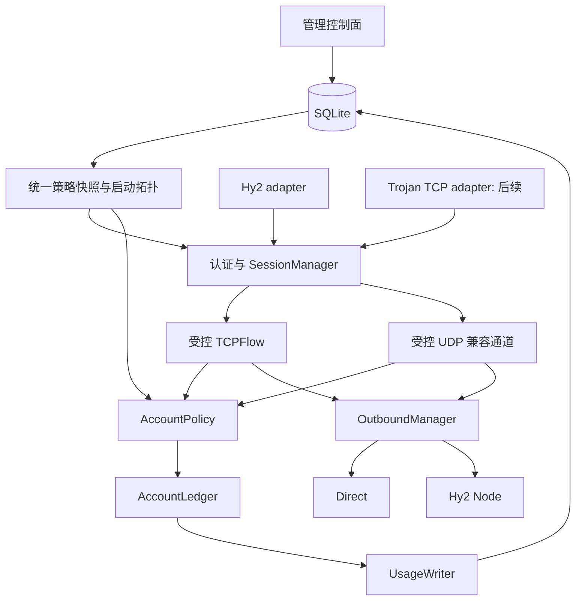

# 入站协议与策略内核重构方案（修订版）

日期：2026-09-08

状态：设计已确认，S0 实施中；离线配置工具及 S1 的 `obfs`/`masquerade` 单项修复已完成，本文是后续实现与验收契约。

修订对象：[INBOUND_POLICY_REFACTOR.md](INBOUND_POLICY_REFACTOR.md)。

## 1. 评审结论

保留“协议 adapter + 共享策略内核 + 独立出站资源管理”的方向，先建立共享修复基线，再迁移 Hy2，最后单独迁入已有 Trojan TCP。原提案不能直接进入阶段 2 编码：身份、计量、快照和生命周期边界需要收紧；单纯依赖 session token 与 flow 包装也不能补出 Hy2 缺失的请求上下文、整连接关闭和完整 Wait 能力。

本修订采用保持 wire protocol 的最小 Hy2 接口补丁，覆盖 server 和 client。共享层统一用户策略、账本与请求所有权；Hy2 UDP 保留其既有计量事件边界，不能强行套用“完整 datagram 只计一次”的通用模型。补丁能力须先验证，再冻结接口。

本文替代原提案中相冲突或不可实施的部分。第 3 节给出问题及依据，第 4 至 11 节给出完整修订方案，第 12 至 14 节给出实施和验收要求。

## 2. 范围与比较基线

### 2.1 已明确的范围

| 项目 | 本次采用的约束 |
|---|---|
| 交付顺序 | master 上的共享修复 -> Hy2 内核/配置迁移 -> 单独迁入 Trojan TCP。 |
| Hy2 依赖 | 允许最小接口补丁和必要的受控 fork，保持 wire protocol，固定版本与补丁 commit；优先推动上游接纳。 |
| UDP 计量 | 不实施完整报文只计一次的口径调整；本轮按保留现有 Hy2 UDP 计量执行，包括已知的分片重复下载计量。 |
| 配置迁移 | 交付用户自行运行的旧 YAML -> 新 YAML 脚本；开发与验收只操作测试夹具，不代用户迁移、重启或部署生产服务。 |
| 当前验收目标 | 当前 Hy2 功能不回退；不额外要求指定第三方客户端版本矩阵或生产迁移服务。 |
| 后续功能 | Trojan UDP、mux、fallback、Trojan 订阅、BIND、TCP 半关闭、独立凭据表不属于本次 Hy2 核心重构。 |

本方案明确决定本轮不调整 Hy2 UDP 计量口径，也不单独修复分片重复下载计量。保留问题不等于认定现有计量正确；任何口径修订都必须作为后续独立变更重新定义基线、迁移影响和验收结果。

新 YAML 采用具名 `name/type` 列表，是本方案选用的实现设计；不把它扩写成新增每入站套餐、独立证书或动态热加载的产品需求。

继续保留：显式 `direct` 授权和节点选择、无自动 fallback；用户跨节点/连接共享月额度和下载限速；约两秒刷新生命周期字段；新用户、节点和授权重启生效；完全空闲会话不因策略变更主动踢除；SQLite 单 Gateway 实例。

“可归属用户的协议头及失败路径流量也应计量，尽量接近真实入站/出站流量”已列为第 15 节 TODO-TRAFFIC-01。本文 S0–S5 仍按现有计量口径验收，该 TODO 是后续独立口径扩展。

### 2.2 三个不同基线

| 对象 | 版本与用途 |
|---|---|
| 重构分支起点 | `master@99f4ce46f155878f6ad0d58e2a26de0078a45ba1`；建议分支 `refactor/inbound-policy-kernel`。 |
| 当前功能参考 | `9b93d1045fc3e9e0c1c5add97471b08b12d9acdf`；提取已有共享修复、Trojan 协议代码及测试，不整笔 cherry-pick。 |
| Hy2 依赖基线 | `github.com/apernet/hysteria/core/v2 v2.8.1`；同时固定实际 quic-go 依赖和后续补丁版本。 |

“从 master 开始”不表示可以丢失当前已确认的 Hy2/共享修复。每项先判断在 master 中是“已经存在”“仍有缺陷”还是“新增能力”，再决定保留、独立修复或后续迁入。不得为了拆分而制造一条本来就在 master 上通过的“修复前失败测试”。

代码证据的本项目行号以本次检查的 `9b93d10` 内容为准；Hy2 路径均指该依赖的 v2.8.1 源码。本次未联网重新核实上游分支或 PR 状态。

## 3. 原提案需要修正的问题

P0 表示会阻断相应内核契约的冻结与迁移；P1 表示必须在对应可发布阶段解决。独立且已可验证的共享修复可以先交付。

| 编号 | 级别 | 原提案问题与实际影响 | 修订要求与依据 |
|---|---|---|---|
| R01 | P0 | 将 session token + flow 与 fork 并列为完整路线仍不充分。token 不能补出同一 QUIC 连接内的 request context，普通 flow 错误也不会执行旧 TrafficLogger 的整连接关闭。 | 采用最小补丁；提供真实请求关联、取消、指定连接关闭和 Wait。参见原提案的“核心契约草案”及 Hy2 `server/config.go:156`、`:246`、`server/server.go:320`。普通 flow 拒绝后同连接仍可再发 TCP 请求，该现象必须在 S0 转化为仓库内回归测试。 |
| R02 | P0 | 原提案公开可构造的 `Session`、`Open(session)`、裸 `DialTCP` 和独立 `Admit`，与“认证后由内核签发且不可漏计量”冲突；同时不能承诺 Go handle 本身不可复制。 | 认证签发不透明 handle；请求由内核创建；普通 TCP 只返回受控 flow；私有字段、活跃登记和 owner/epoch 验证共同约束。合法复制是同一会话的别名。参见原提案的“核心契约草案”。 |
| R03 | P0 | 原提案没有完整描述 Hy2 UDP 分片账务。把计量移到 PacketFlow 会改变残缺分片、首次出站失败、整包发送失败后分片等情况。 | 保留兼容事件及其先后顺序，账本仍共享。Hy2 `server/server.go:343`、`:367`、`server/udp.go:189`；3000 字节双向 echo 的临时观察值为 tx=3000、rx=6000，S0 必须提交可复现测试。详见第 7 节。 |
| R04 | P0 | `bool Admit` 没有区分计量结果和关闭范围；将 UsageRecorder 当 observer 又要求跨对象原子更新，锁与事务所有权不清。 | 单一 AccountLedger 拥有额度基线、用量、pending/in-flight；Decision 明确原因、计量结果及动作。保留现有 `internal/traffic/logger.go:332` 的原子计量资产，不能改成异步计费。 |
| R05 | P1 | 原稿要求请求隔离，但忽略“请求关闭错误被当作共享节点故障”。当前单个 UDP association 关闭后的 EOF 会触发整个 node client 关闭，伤及其他用户请求。 | 单独定义请求错误与节点连接错误；按连接 generation 验证故障来源。临时诊断曾观察到该现象，S1 必须提交正式复现。静态位置：`internal/router/factory.go:345`、`:295`，Hy2 `client/udp.go:35`。 |
| R06 | P1 | 只给 TCP 拨号加 ctx 仍不完整：节点初始化握手、鉴权 HTTP 请求、UDP 目标 DNS 和关闭等待都可能不可取消。取消后的错误还可能被旧 client 包装成 ClosedError。 | 补丁覆盖连接建立和请求阶段；Direct UDP 使用可取消 resolver；真正的连接故障才重连。`internal/router/factory.go:64`、`:80`，`internal/router/direct.go:55`；Hy2 `client/client.go:43`、`:198`、`:236`。此项为静态证据。 |
| R07 | P1 | 单个 atomic snapshot 的方向正确，但还必须定义“发布完成后不再按旧策略准入”的提交边界，并处理启动数据与 revision 的一致性。 | 统一策略快照、发布闸门与每用户唤醒机制；在同一 SQLite 只读事务读取启动 users/routes/nodes/revision。`cmd/gateway/main.go:87`、`:240`、`:430`；`internal/storage/management.go:374`。 |
| R08 | P1 | 原提案仍先等 handler，再关 OutboundManager；这可能卡在远端 CONNECT。Manager 条目也没有覆盖 HTTP、预热/重连、错误通道阻塞和完整子 worker。 | Close 先发起关闭，Wait 后等待；入站与出站取消并行，最终 flush 在写入静止后执行；失败有界退出。参见原提案的“管理后台与控制面”；当前 `cmd/gateway/main.go:293`；Hy2 `server/copy.go:52`、`server/server.go:92`。 |
| R09 | P1 | 原提案阶段 0 拒绝旧 YAML、阶段 4 才启用新运行时，相互冲突；已有管理数据 `migrate` 也依赖当前 `config.Load`。 | 早期只交付迁移脚本和 validator；运行时在切换 PR 才换 schema。分离旧管理数据 loader，回归 `migrate --replace-users` 与 `record-exit`。参见原提案“阶段 0”和“阶段 4”；`cmd/gateway/main.go:331`、`:450`。 |
| R10 | P1 | 原提案以协议名作为 map key，限制实例数；改为列表后，仅给 listener 加 name 仍不够，订阅、冲突校验、状态展示和错误通道都要支持多个实例。 | 统一 `inbounds` 列表；保留一个现有 Hy2 订阅端点，显式绑定一个入站。所有监听按传输协议校验，并以实际 bind 为最终判定。`internal/api/database_subscription.go:134`。 |
| R11 | P1 | 把“每次 Read/Write 包装”当作完整计费方案，遗漏下载返回 `n>0, err`、io.Copy 快路、短写重试和读取块大小。 | 拒绝块不得向调用者暴露；不导出原始连接或未受控快路；保留 32 KiB 读取缓冲、读后写前计量、短写不退款。Hy2 `server/copy.go:11`；`internal/trojan/server.go:415`。 |
| R12 | P1 | 新 registry 若沿用裸 StreamID、远端地址或同目标 FIFO，仍会混淆连接和请求；现有 JSON 的 `protocol` 实际表示 TCP/UDP。 | 使用进程 epoch + 实例 + SessionID/RequestID；旧字段含义不变，新增入站名称和类型使用新字段。`internal/traffic/logger.go:570`；`internal/connection/tracker.go:30`、`:95`。 |
| R13 | P1 | 修复基线与范围分类前后矛盾：部分必要修复又被列为“无关改动”；对严格 YAML 的判断也必须区分 master 与参考提交。 | 严格 YAML 在 master 是新增修复，在 `9b93d10` 已存在；禁用节点过滤在 master 已存在。订阅、迁移校验与构建正确性逐项评估，不能机械排除。`internal/config/config.go:193`。 |
| R14 | P2 | 原提案把阶段 0 扩成 Trojan TCP+UDP、指定第三方客户端矩阵，并把半关闭和 mux/fallback 纳入通用验收；工期和节省比例缺乏能力验证支撑。 | 恢复本轮 Hy2 范围；Trojan TCP 后续迁入；其他扩展独立安排；能力验证后按 PR 重新估算。 |

上述问题进一步固定三点：零补丁方案不作为完整路线；不把 handle 的合法复制本身当作漏洞；严格 YAML 的判断必须带版本。R03、R05、R06、R11、R12 必须进入实施检查，不能只修改架构图。

## 4. 统一术语与所有权

| 术语 | 固定含义 | 不混用为 |
|---|---|---|
| 用户 | 数据库中的用户，是月额度、下载限速和生命周期的共享主体。 | 单个会话、单个节点配额。 |
| 节点 | 用户显式获授权并选择的出站路径；`direct` 是内建的显式路径。 | 本机监听、请求目标地址。 |
| 路由 ID | 外部凭据映射使用的 `username:node`。 | 认证证明、会话句柄。 |
| 入站实例 | 一个稳定名称对应的一份协议监听配置。 | 协议类型、客户端连接。 |
| 传输连接 | 一条 TCP/TLS 或 QUIC 连接，可以尚未认证。 | 必然已在线的用户会话。 |
| 认证会话 | 一次成功认证在特定传输连接上的身份绑定。 | 用户全局状态、QUIC StreamID。 |
| 请求 | 认证会话下的一条 TCP stream 或 UDP association。 | TCP 目标字符串、UDP 单个分片。 |
| UDP 计量事件 | 当前 Hy2 回调处的一次 payload 计量；可能是收到的分片或一次发送尝试。 | 必然成功转发的完整 datagram。 |
| 用户账本 | 用户已计量用量、月份基线与待持久化增量的权威状态。 | 可丢失的观测事件。 |
| 流量方向 | `tx` 是 Gateway 向逻辑最终目标发送的 payload；`rx` 是 Gateway 从逻辑最终目标接收、准备发给客户端的 payload。经过 Hy2 Node 时仍按逻辑目标方向定义。 | Gateway 与中转节点之间的物理链路方向、TLS/QUIC 封装字节。 |

同一用户通过两个入站、两个节点并发请求时，使用同一额度与下载时间线；一个请求取消不关闭另一入站、另一会话或共享节点。某会话触发停用/到期/额度拒绝时，关闭其绑定的 Hy2 QUIC 连接；其他完全空闲会话不被批量扫描踢除。

新 registry 可以先登记未建立出站的内部请求以便取消，但旧管理页面的“在线”和“请求”显示时机应单独映射，不能因内部提前登记而改变外部统计语义。

## 5. 目标结构与模块迁移



图中的箭头表示调用或数据依赖，不表示认证材料可以直接换成出站连接。UDP 兼容桥接由受限入口和内核内部 flow/controller 共同实现；普通 adapter 拿不到 OutboundManager 或裸连接。

| 现有代码 | 修订后的责任与迁移方式 |
|---|---|
| `cmd/gateway` | 继续作为组装点，创建 adapter、共享组件和进程级关闭协调；不直接调用具体 Hy2 server API。 |
| `internal/auth` | 保存/读取统一策略视图，验证协议已解析的强类型 proof。Hy2 接口签名包装移入 adapter。 |
| `internal/event`、`router.RoutingOutbound` | Hy2 回调适配收敛到 Hy2 adapter。补丁完成后显式传递请求绑定，不继续以单槽 channel 作为最终身份机制。 |
| `internal/traffic` | 提取 AccountPolicy、AccountLedger、UsageWriter 的责任。可以先保留在同包私有实现中，不要求三个公开服务。Hy2 shim 移出共享实现。 |
| `internal/connection` | 改为基于真实 ID 的内部 registry，提供与现有管理输出兼容的只读快照。 |
| `internal/router` | 保留协议无关路由及出站管理接口；具体 Hy2 Node 实现移入出站适配包，其 Hy2 import 不进入共享内核。 |
| `internal/config` | 运行时新 schema、独立管理数据 legacy loader 和迁移工具共用的新 validator，各有明确入口。 |
| `internal/storage`、`internal/api` | 保持持久化模型和控制面行为，补齐一致读事务、可取消存储操作以及稳定读模型。 |
| `internal/trojan` | 后续复用现有 parser、proof、TLS/首包资源边界和测试，改接 SessionHandle/TCPFlow。 |

`inbound.Manager` 只管理入站的构造后生命周期、错误和状态，不拥有用户、SQLite、DNS 或额度。HTTP、systemd、快照刷新、节点预热/重连、周期 flush 属于进程级协调。由组装点用窄的生命周期契约协调即可，不引入泛化 service locator 或另一套业务 Runtime。

## 6. 认证、请求与受控 TCP API

### 6.1 身份签发

以下是能力契约，方法名可在能力验证后调整：

```text
绑定入站实例的 Access
  AuthenticatePassword(transport, passwordProof) -> SessionHandle
  AuthenticateSHA224(transport, sha224Proof)     -> SessionHandle

SessionHandle
  OpenTCP(requestContext, target) -> TCPFlow
  Close(cause)                   -> 发起会话关闭
```

`transport` 是 adapter 在接受连接后登记的资源绑定，不携带用户身份；认证失败不签发 SessionHandle、不拨号、不增加用户在线数和账务。Access 绑定 composition root 注册的入站，adapter 不能用任意字符串登记“已认证 Session”。

SessionHandle 只包含私有状态引用。方法验证 manager owner、进程 epoch、活跃登记和绑定传输；零值、失效句柄及跨 manager 的引用拒绝。合法复制指向同一会话，关闭后所有别名失效。公开的 SessionID/RequestID 只用于观测，不能当成重新取得 handle 的凭据。

Go adapter 是同进程受信代码，不能声称这种 API 是恶意插件沙箱。通过包依赖检查、窄入口和真实流量测试防止正常实现漏调策略；不使用反射或 unsafe 访问 Hy2 私有状态。

OpenTCP 内部创建 RequestID/context 并绑定已经认证的节点；目标地址只决定该节点之后的目的地。开始拨号前检查当前用户生命周期和停止状态，不能因为已持有 SessionHandle 就永久跳过策略。密码重置只影响新认证，不重新验证旧会话的原密码；节点授权仍读取启动拓扑。

### 6.2 TCPFlow

- 私有保存原始连接，显式实现需要的 `Read/Write/Close/deadline`；不嵌入可导出的裸连接，不提供 Unwrap、SyscallConn 或未经计量的 ReaderFrom/WriterTo。
- 上传：每次从客户端读取完整 chunk 后，通过 flow 的写入路径完成策略与记账，允许后才向目标执行一次 Write。
- 下载：从目标读取 payload 后先限速、准入、记账，再向 adapter 返回数据；拒绝时不得返回可被转发的 `n>0`。即使底层一次读取返回数据与 EOF，也要先判断数据是否允许转发。
- 保留现有 32 KiB 读取缓冲和读后写前顺序；短写或写失败保留已计量字节，结束请求，不把同一块重提一次收费。
- 若使用 io.Copy，证明类型提供的快路仍经过策略；Hy2 TCP 旧计费 callback 与 flow 之间只保留一个收费入口。仅保留 trace/online 观测时，也要验证上游走哪条 copy 路径。
- 一侧 relay 结束时保持当前关闭两侧的行为，并等待两个方向退出；本次不新增半关闭语义。

并发网络读取的具体分块受调度影响，因此等价验证比较同一输入读取序列、缓冲上限、触发块规则与转发结果，不承诺任意网络调度下每次 Read 的大小都相同。

Close 必须幂等并先发起取消/资源关闭，不在策略回调或 registry 锁内等待当前 handler。等待由外层 Wait 完成，防止关闭回调等待自己。

## 7. Hy2 UDP 兼容路径

### 7.1 保留的计量事件

| 事件 | 本轮必须保持的行为 |
|---|---|
| 协议头解析失败 | 沿用当前拒绝/丢弃行为，不凭完整 UDP 载荷长度补记用户流量。 |
| 合法分片到达 | 在重组前按该片 Data 长度准入与计量；即使最终缺片，也保留已经发生的计量。 |
| 完成重组并首次打开出站 | 不为完整包重复收费；已经计量后拨号失败不退款。 |
| 下行发送完整消息 | 保留当前 SendMessage 中“先准入计量、后序列化和发送”的位置，包括其后失败的情况。 |
| 下行因过大改为分片 | 每次分片 SendMessage 仍执行对应事件；不因完整尝试已经收费而跳过它，也不再增加 flow 级第三次收费。 |
| 重复片、重组失败、过大包、队列满 | 以固定版本的具体解析/计量/丢弃顺序为准；增加对照测试，不凭“UDP 丢包”概括所有计量规则。 |

3000 字节示例只表示本地触发分片的特定场景；不是所有 UDP 下载恒定乘二。回归还必须比较超额发生在哪次尝试、哪些分片实际发出、限速等待发生几次及各事件归属月份。不能只比较最终 tx/rx 总数。

### 7.2 受限兼容入口

Hy2 UDP 不直接复用“完整 datagram 自动计费”的通用 PacketFlow API。由专用兼容驱动器连接补丁中的事件 hook 与内核 controller；它与普通 TCPFlow 共用 AccountPolicy/AccountLedger，但拥有单独的事件状态机。驱动器不能作为其他协议随意选择的免计量模式。

约束如下：

1. hook 携带已绑定的认证会话、协议 association 标识及其生命周期 generation。内核生成 RequestID；不能信任客户端的 UDP SessionID 在跨连接或跨代际时唯一。
2. 首个合法片段可能早于实际出站建立。先为其建立可取消的内部请求绑定或待建立状态，完成原计量位置的准入，再进入原重组流程；这不代表提前打开出站或改变管理页的请求显示时机。
3. controller 是每个事件唯一的账务提交入口。其结果由兼容驱动器立即应用到对应重组/发送步骤，不存在 adapter 自行填用户名、节点或 `alreadyCharged=true` 的公共路径。
4. 如分层实现必须传递已计量凭证，凭证只在内核与该受限驱动器间使用，绑定 owner、Session/Request generation、方向和对应数据操作，并只能消费一次。不得退化为可挪用的“剩余已收费字节余额”。
5. 重复到达的分片是新的兼容计量事件，但已经执行的同一事件不能因内部重试再次提交账本。完整包重组后继承其已准入片段的来源，不再重新计量。
6. 下行原始整包和随后分片是不同事件；每次都在原位置重新检查策略和限速。不能在从 outbound 读出时提前一次性收费后伪造后续事件。
7. 不完整包、被替换片段、超时 association、取消或失败必须回收待处理凭证/绑定；已经提交的账务不退款。新增状态与既有 association/重组生命周期一起有界回收，不能每收到一片就留下永久 registry 项。
8. 底层 UDP 发送不是并发安全的通用能力。当前 Hy2 client 的 `udpConn.Send` 复用 SendBuf；保持单 association 的发送串行，或在对应封装中同步，不把共享资源锁持有到下载限速等待期间。

UDP 驱动器及关联方式必须先用真实 Hy2 core 跑通，尤其验证“先计量后形成 association”与发送分片重试。若需要凭证，它是这一小范围兼容机制的内部实现，不提前扩成面向所有协议的交易框架。

### 7.3 拒绝与关闭范围

停用、到期、超额等策略拒绝必须触达发起请求的 Hy2 QUIC 连接，保持既有整会话作用范围。只令 `WriteTo` 返回普通错误不足以保证这一点，server 的某些 UDP Feed 错误原本会被忽略。

普通单包地址/发送错误与策略拒绝分型：前者按当前协议规则丢包或关闭 association，后者执行明确的 CloseSession。association 正常关闭或取消只结束本请求，不触发共享 Hy2 Node 重连。

## 8. 策略快照、账本与持久化

### 8.1 启动拓扑与热更新

StartupTopology 在同一 SQLite 只读事务中读取 users、routes、启用 nodes 及 topology revision，事务结束后不再持有数据库读锁；其用户集合和授权在重启前固定。

PolicySnapshot 保存这些启动用户的密码、停用/删除状态、到期、额度和下载速率，并有独立的进程内 PolicyRevision。构建时生成一致的密码验证视图和所需 SHA-224 索引，完成后一次发布，不允许两个协议的 auth 和账务分别发布不同版本。

刷新失败保留上一份已发布策略、记录错误并继续重试；不能把读取失败当作空用户/零额度快照。到期仍在准入时按时间检查。该规则沿用当前刷新失败行为，不额外承诺在数据库不可读时立即获知新撤销。

### 8.2 发布与准入的顺序

可以采用短时读写发布闸门：认证最终签发和流量最终提交持读锁；发布新快照及更新每用户 generation/change 通知持写锁。发布完成后开始的认证/准入必须读取新策略；发布前已提交的块不追溯退款。

限速、网络操作和 SQLite 查询不持发布闸门。等待醒来后重新检查用户状态、速率和 generation；额度/速率/停用/到期变化唤醒对应用户，没有变化的两秒刷新及单纯密码变化不重置下载时间线。沿用当前允许首块突发和取消尾部预约的行为，不借此引入新的限速算法。

最终准入再次检查 request context 和停止状态。入口处检查一次 ctx 不足以防止等待期间或跨月读取期间发生的取消。

### 8.3 单一账本提交

```text
读取策略 -> 必要的下载预约/等待
         -> 在发布闸门外准备可用的当月基线
         -> 进入最终提交临界区
         -> 重验 context / 停止状态 / 策略版本 / 月份 / 生命周期
         -> 同时更新用户月累计、用户节点统计与 pending
         -> 返回 Decision -> 协议执行转发或关闭动作
```

若准备期间月份或策略发生变化，释放锁后重试；不能带着过期基线提交。锁序写入实现说明并通过竞争测试固定：正常提交按发布闸门 -> ledger；flush/月度重载按 flush 协调锁 -> ledger，持 ledger 时不反向等待发布或 flush 锁。

Decision 是内部结果，至少表达 `Reason`、`ChargedTx/ChargedRx` 和 `Action`。不向普通 adapter 导出与裸连接配套的公共 Admit。

| 情况 | 记账结果 | 动作 |
|---|---|---|
| 正常事件 | 计入完整 TCP chunk 或对应 UDP 兼容事件 | 允许下一数据步骤。 |
| 未知/停用/到期用户 | 不计量 | 关闭当前认证会话。 |
| 提交前可观察到的请求取消 | 不计量 | 关闭本请求；会话取消则随父级关闭。 |
| 正在停止 | 不接收新计量 | 停止请求/会话。 |
| 当月额度基线读取失败 | 不计量、不按零用量放行 | fail closed，关闭当前会话并返回可诊断的存储失败。 |
| total == limit | 计量并允许 | 保持现有边界。 |
| total > limit 的触发事件 | 整个事件已经计量 | 不转发该事件，关闭当前认证会话。 |
| 准入后短写/发送失败 | 保留已经计量的字节 | 按请求/报文错误规则结束或丢弃。 |

额度拒绝与会话关闭之间保留现有并发窗口，不增加账户耗尽 latch：触发超额的提交先完整计量并返回关闭动作；在 Session 的 closing 状态对其他请求可见之前，已经进入最终账本提交的并发事件仍按同一规则继续完整计量，也可能再次返回关闭动作。SessionManager 将 closing 状态发布后，后续事件按生命周期拒绝处理且不计量。测试必须用可控屏障固定这两个线性化点，不能只断言最终连接已经关闭。

额度 0、下载速率 0 继续表示不限。不能改成只计成功写出的字节、按剩余额度截断块，或取消已经完成的账务提交。取消与准入以最终受控检查/提交点排序；不承诺账务提交与随后网络写入之间存在跨对象的物理原子性。

### 8.4 持久化与最终刷盘

AccountLedger 独占 pending 与 in-flight batch，按用户/节点/自然月分组并保存原计量时间。UsageWriter 只负责持久化，不另维护额度计数器；观察指标可以异步，账务不能异步漏记。

flush 从账本分离 batch 后在 ledger 锁外执行 SQLite 事务。失败完整合回原月份；成功不重新加入。月份重载与 in-flight flush 通过统一协调锁排序，避免将同一批同时当作数据库基线和 pending；迟到批次不得回退 summary 时间戳。

最终刷盘入口应返回错误并接受独立的截止 context，不能沿用只记日志的 `Flush()` 结果就报告成功停机。为有关 SQLite 查询/事务补齐 context 和实际忙等待测试；把同步 I/O 放进 goroutine 后超时返回不算取消完成。

不在本次引入崩溃级 exactly-once 或新的 durable journal。进程崩溃仍可能损失未落盘增量；持续写入失败可能累积多个周期，最终未持久化必须可诊断并导致失败退出，不能声称“最终 flush 无论何种故障都不丢数据”。

## 9. Hy2 补丁与出站资源契约

### 9.1 最小补丁必须覆盖的能力

| 层次 | 所需能力 | 必须证明的场景 |
|---|---|---|
| server 传输与认证 | 稳定连接绑定；认证上下文；按连接关闭；未认证连接也被跟踪。 | 两连接相同 StreamID、同源地址复用、重复认证不重复增加会话。 |
| server TCP | stream 从请求解析开始有可取消绑定；上下文传到出站和准入；两个 copy worker 可等待。 | 同会话同目标并发；一请求取消不串身份；拒绝关闭正确 QUIC 连接。 |
| server UDP | 在原计量点携带 association/generation/context；完整关闭与回收通知；worker 可等待。 | 首片早于出站、缺片/重复片、分片重试、超额作用范围、空闲清理。 |
| client 初始化 | QUIC 建连与认证 HTTP 请求接受节点管理 context；失败释放所有已取得资源。 | 远端接受连接但不答认证，停止进程仍能取消并结束预热/重连。 |
| client TCP | 打开 stream、写请求头、等待 CONNECT 确认均接受请求取消；只关闭对应 stream。 | 远端不答 CONNECT 时取消 A，B 仍可使用同节点。 |
| client UDP/生命周期 | association 本地关闭可识别；连接真实故障可识别；全部 receive/cleanup worker 可等待。 | A 正常关闭后 B 的 TCP/UDP 均继续；连接真断开只触发对应 generation 的重连。 |

优先增加可选接口，保持上游默认协议行为；Gateway 固定使用已验证版本。保留 MIT 版权/许可证与补丁差异清单，补丁目标包括 server、client 和必要的依赖接口；不预设修改文件数或承诺只能改几个函数。

不使用 RequestHook 的 server-side fast-open 偷渡身份，因为它会在真实目标连接成功前发送成功响应。也不将 client FastOpen 当作取消补丁的替代，因为它会改变 CONNECT 成功确认时机。

### 9.2 取消必须到达实际阻塞操作

节点预热、DNS、多地址连接尝试和重连使用 OutboundManager 自己的 context，单用户请求取消不终止共享连接建立。进程停止则必须取消这些任务；若取消后某次连接才成功返回，检查 manager 状态/generation 并立即关闭，不能重新发布 Ready。

每条 TCP/UDP 请求使用 Session 的子 context，并同时响应调用方更早的取消。Direct TCP 使用 DialContext；Direct UDP 的目标解析使用可取消 resolver，保留目标地址、IPv6 zone 和现有解析选择规则，不顺带改路由或 DNS 缓存策略。

不能把“客户端离线”写成任何网络情况下都能立即知道。以可观察的 QUIC 连接关闭、stream reset/停止信号、TCP/TLS 读写终止及 deadline 为依据；没有可观察信号时依赖协议超时。所用 quic-go 的 `Stream.Context()` 描述为写方向关闭时取消，不能未经验证当作双向请求生命周期。

若 Trojan 在等待出站时需要读客户端以发现断开，该 reader 必须由请求拥有、有界缓存预读 payload、保序交给后续 relay 并被 Wait 覆盖；不能丢掉首包、重复读取或启动无法回收的旁路 goroutine。具体机制在 Trojan 迁入阶段验证。

### 9.3 请求错误与节点故障

取消、单 association 的 EOF、单 stream 错误、目标拨号拒绝、UDP 包过大不是共享节点死亡的充分证据。不能仅按 `io.EOF`、`net.ErrClosed` 或旧 ClosedError 包装决定重连。

补丁/适配层应提供可区分的请求关闭和连接终止原因；必要时结合底层 QUIC 连接状态。只在确认当前 generation 的共享连接失效时，OutboundManager 才将节点置为 Unavailable、关闭它并安排重连。来自旧 generation 的延迟错误不得关闭新连接。

保持既有 DNS 刷新、SNI、连接尝试并发上限、backoff、失败快速返回与无 fallback 行为。节点不可用是局部路由故障，不应阻止其他节点/direct 服务启动或触发整个 Gateway 重启。

## 10. 启动、关闭与观测

### 10.1 启动与失败回收

生命周期为 `Constructed -> Bound -> Serving -> Stopping -> Stopped`；构造/运行失败记录 Failed，并进入同一资源回收路径。

1. 严格解析配置，验证各实例并加载共享证书；从一致数据库视图构建启动拓扑与策略。
2. 同步取得所有配置启用的 UDP/TCP 入站和 HTTP listener。构造任何组件失败，按明确的资源所有权回收已经绑定的 listener、连接和启动的 worker。
3. 每个 adapter 使用独立的协议配置对象；共享证书来源不等于并发修改同一个上游 Config。保留 Hy2 QUIC/ALPN 行为与 Trojan TLS 最低版本。
4. 启动必须的 serve loop、刷新/调度任务和节点管理；节点预热仍是有界等待，不要求所有远端节点 Ready。
5. 在必需组件已启动、数据库可用且没有启动失败时发布 ready，记录实际加载的 topology revision。启动失败不能先把数据库 active_revision 标成最新保存版本。

ready 与错误接收通过同一状态协调，任一非预期 Serve 返回（包括 nil）触发全局停止。已进入 Stopping 后的预期关闭错误才归一化为正常退出。

多实例不得继续使用假定“最多四个服务”的固定错误通道并阻塞发送者。使用能保存首个失败并触发一次取消的机制；保留错误来源，后续退出报告不得阻止 worker 完成。

### 10.2 停机顺序

默认整体 shutdown 预算为 15 秒，其中最多 12 秒用于停止接入、强制关闭和等待 worker，至少预留最后 3 秒用于最终 flush 与 SQLite close。实现可将总预算与 systemd 配置配套调整，但必须显式保留 finalization 预算，不能让前一阶段耗尽全部 deadline。

1. 进入 Stopping，关闭认证/新请求/最终计量准入闸门，等待已开始的账务提交离开临界区；停止新控制面写入及刷新/调度，唤醒限速等待。
2. 停止 accept，取消 Session/Request、关闭入站传输；同时取消并关闭 OutboundManager 的连接、拨号和重连资源。不能先等待所有入站，再关共享出站。
3. 在 worker 阶段的 12 秒预算内等待入站、HTTP 处理、出站 worker、快照刷新和调度任务退出。Close 发起关闭，Wait 证明收敛，两者不能互相递归等待；提前完成时，未使用时间可以增加 finalization 的可用预算。
4. 停止并等待周期 flush；使用独立于已取消运行 context、且至少包含预留 3 秒的 finalization context 执行最终 flush，检查错误，最后关闭 SQLite。

Wait 必须覆盖 accept/serve loop、尚未认证的连接、请求解析、拨号、TCP 两方向复制、UDP 接收/重组/清理、预读 reader 和协议库自有后台 worker。只等待 Session registry 清空或顶层 Serve 返回不算完成。

worker 阶段超时后立即强制关闭仍持有的 transport/flow，确认步骤 1 的账务闸门已关闭且在途提交已经离开，再进入预留的 finalization 预算持久化已有数据；记录未收敛组件和持久化失败，非零退出。不得把 timeout 返回描述成“全部 goroutine 已退出”，也不得在账本尚可能写入时报告最终刷盘成功。

HTTP Shutdown 与数据面共享 worker 阶段预算，超时后关闭 HTTP 连接并追踪 handler 结束；不能先独占一段完整 HTTP 超时，之后才开始取消数据面，也不能侵占预留的 finalization 预算。应用预算和 systemd TimeoutStopSec 在实现 PR 中配套给出，并用进程测试验证。

### 10.3 管理读模型

- 保留管理服务 loopback、CSRF、no-store、订阅 bearer token 和当前 HTML/JSON 使用方式。
- 用 SessionID/RequestID 精确删除状态，不按 target FIFO、裸 StreamID 或客户端地址删除。QUIC 远端地址变化只更新展示，不改变绑定身份。
- 保持现有 `requests[].protocol` 为 TCP/UDP；入站名称和类型使用新增字段，不重定义旧字段。现有累计 tx/rx 是已计量值，不改成成功转发字节。
- 在线数按当前入站的既有建立/关闭时机投影，恰好增加和减少一次。Hy2 在认证成功后在线；迁入 Trojan 时保留其成功建立 relay 后的既有展示边界。
- 将当前单个 GatewayListen 展示改为可列出所有入站的读模型，并保持既有页面可用；核心重构不做管理 UI 重写。
- topology revision 表示启动拓扑，PolicyRevision 表示进程内热更新。不能用一个“最新 revision”同时证明两者全部生效。

## 11. 配置与一次性迁移脚本

### 11.1 唯一运行时 Schema

以下为切换阶段的 Hy2 配置示例，省略的其他运维字段沿用现有行为：

```yaml
inbounds:
  - name: hy2-public
    type: hysteria2
    listen: ":8443"
    quic:
      maxIdleTimeout: 30s

tls:
  cert: ./cert.pem
  key: ./key.pem

admin:
  listen: "127.0.0.1:9090"

sub:
  listen: "127.0.0.1:9091"
  publicURL: "https://sub.example.com/sub/"
  inbound: hy2-public
  serverAddr: "gateway.example.com:8443"
  sni: gateway.example.com
  insecure: false

dbPath: ./traffic.db
timezone: Asia/Shanghai
trafficFlushInterval: 10s
```

约束：

- `inbounds` 是非空列表，name 非空且唯一，type 必须是当前版本实际实现的类型；不按列表顺序推导永久身份。
- 同协议可以有多个具名实例。核心切换阶段只接受 `hysteria2`，不接受会静默停用的 Trojan 占位配置。
- 顶层证书共享；QUIC 参数属于 Hy2 实例。Trojan TCP 后续合入时，在同级列表项加入 type: trojan 及其握手/资源参数，沿用现有默认值与范围。
- 严格拒绝未知字段、重复键、多 YAML 文档、旧入站字段以及不属于当前 type 的参数；通过 yaml.Node 再解码也必须保留严格检查，不能因多态解码跳过 KnownFields。
- 不引入 enabled 与空 listen 两套禁用语义：新运行时未列出的实例即不存在，列出的实例必须有效。迁移脚本负责映射旧配置的省略/默认/禁用行为。
- UDP 与 TCP 可以使用相同数字端口；同传输的入站、管理 HTTP 和订阅 HTTP 都进入冲突检查。确定的冲突预先报错，域名/双栈重叠由实际 bind 判定并回收，不只比较地址字符串。
- 启用订阅时必须有 `sub.inbound`，指向存在的 Hy2 实例；不存在或类型错误均失败。保留一个订阅端点及现有路由条目，不自动枚举所有入站生成多套代理。
- `sub.serverAddr` 保留为显式客户端地址，可以与 bind 地址不同以支持反向代理/NAT；不从 listen 或列表第一项推测公网地址。
- 此前 master 会解析 `obfs`/`masquerade`，但 Gateway 数据面并未实现对应能力。S1 已将这两个字段改为启动时明确拒绝，并提供失败用例、迁移诊断和 release note；这属于正确性修复，同时也是用户可见的启动行为变化。S4 的新 schema 与迁移脚本继续拒绝，不能静默忽略或宣称已支持。

### 11.2 脚本契约

S0 已交付脚本入口与可复现的转换实现，复用本项目 Go/YAML 库和新 schema validator：

```text
scripts/migrate-inbounds --input legacy-gateway.yaml --output gateway-new.yaml
scripts/validate-inbounds --input gateway-new.yaml
```

输入是当前受支持旧版本的运行配置；输出是指定目标版本能够加载的新配置。脚本不启动 Gateway，不加载证书进行联网握手，不打开 SQLite，不调用 systemd。

| 旧字段/情况 | 转换规则 |
|---|---|
| 顶层 listen | 写到生成的 `hy2-public.listen`；省略时将当前实际默认 `:443` 显式写出。 |
| 顶层 quic | 原值迁到 Hy2 实例，不重算传输调优参数。 |
| tls、dbPath、timezone、flush、systemd | 保留值及默认含义；路径仍按原部署 WorkingDirectory 解释。 |
| admin.listen / api.listen | 按当前有效优先级选择管理监听并输出 admin.listen；对被旧优先级遮蔽的不同值给出诊断，不能悄悄选择另一监听。 |
| sub | 保留地址、TLS 元数据和现有订阅行为，增加 `inbound: hy2-public`。 |
| 非空旧 trojan.listen | 只有目标版本已包含 Trojan adapter 才生成具名 Trojan 实例；否则拒绝，不能丢掉它后返回成功。 |
| 省略/空 listen 的旧 trojan | 保持原禁用状态，不生成会被新默认值启用的实例。 |
| users/nodes 和旧订阅 secret | 属于独立管理数据迁移。遇到需要处理的数据明确报错并保留源文件，提示先由用户处理管理数据；不得丢弃后假定已入库。 |
| obfs/masquerade、未知字段、无损转换不明 | 报错并标明字段，不自动删除或猜测。 |
| 已经是新 schema | 明确报告输入不是旧 schema；不再次包装 inbounds。 |

输出先在内存中完成转换并严格验证，再写入新目标；使用排他创建等机制拒绝覆盖，不只做一次存在检查。源/目标指向同一文件、别名路径或已有目标时失败。写入失败清理本次新建的部分结果，不能留下看似成功的新配置。日志只给字段路径和诊断，不输出密码、token、secret、私钥或完整配置。

不改变相对路径的基准：文档明确新进程继续使用相同 WorkingDirectory；不因新 YAML 位于另一目录而将相对路径擅自改成该目录。路径、默认值、数组顺序与订阅绑定都加入转换夹具测试。

新 schema validator 必须能在不打开数据库、不绑定端口的情况下运行；另用临时证书/数据库副本和本地 listener 验证转换结果确实能启动。

### 11.3 与旧命令、数据库和回滚的关系

配置转换与管理数据导入是不同工具。`proxy-gateway migrate`、`migrate --replace-users` 保留独立 legacy loader，不复用已拒绝旧字段的新运行时 Load。保留旧 token 派生规则及已有节点/流量保护测试。`record-exit` 使用与对应运行版本一致的配置读取入口并继续可用。

此重构不改 `managed_nodes.config_json` 的出站含义，不新增持久化 session 表，不重建/清空/重新导入现有 SQLite。用 master 与当前参考提交创建的数据库夹具分别验证新版本可加载；正常进程记录和流量写入与迁移脚本的零数据库副作用分别断言。

用户自行升级时保留旧 YAML 和数据库备份，检查脚本输出后再切换新二进制/新 YAML；回滚使用旧二进制和原 YAML。核心阶段不加入破坏数据库向后可读性的 schema 变更。本次交付不代用户执行这些操作，也不承诺零停机切换。

## 12. 分阶段实施与 PR 门槛

| 阶段 | 交付内容 | 合入/退出条件 |
|---|---|---|
| S0：能力验证与工具准备 | 固定 Hy2 server/client/QUIC 版本；验证请求身份、取消、整连接关闭、UDP 兼容事件和完整 Wait；实现独立迁移脚本与新 validator。 | 提供可审查补丁、测试与差异清单；旧运行时仍可部署，不切换 Load。统一 UDP API 在验证前不冻结。 |
| S1：共享修复基线 | 逐项提取已确认正确性修复，并修复 R05 的请求错误误伤共享节点；将 master 对无效 `obfs`/`masquerade` 的静默接受改为明确拒绝；已在 master 存在的行为保留并回归。 | 每项缺陷有失败复现和修复后验证；用户可见的配置拒绝有迁移诊断和 release note；与目录迁移拆开；本轮不调整 UDP 计量规则。 |
| S2：共享内核与 Hy2 生产路径切换 | 一致策略快照、认证句柄、账本与受控 TCP/UDP 兼容入口；使用 S0 补丁接入真实 Hy2，完成显式请求绑定并删除公共单槽 handoff。实现可以暂时保留在现有包位置。 | 有真实调用者；认证失败无用户状态副作用；flow 不能漏计量或串身份；公共单槽路径不再被生产代码使用；发布/取消/跨月边界通过。 |
| S3：Hy2 adapter、出站边界与生命周期收敛 | 将 S2 已切换的生产实现收敛到入站/出站适配层，删除旧 event/router 公共类型和临时兼容代码；接通取消、错误隔离与完整 Wait，不再次切换身份或计量机制。 | Hy2 direct/远端节点的 TCP/UDP、请求隔离、事件账务对照和故障/停机测试通过；S3 相对 S2 不改变请求身份和计量语义。 |
| S4：运行时配置切换 | 同一 PR 启用唯一 inbounds 列表、多个实例、Manager、订阅绑定及全部 CLI 兼容入口。 | 新脚本输出可真实启动；旧 schema 明确拒绝；旧数据库可加载；该版本每个必需 listener 均可用或整体失败回收。 |
| S5：Trojan TCP 迁入 | 复用既有有界 parser、SHA-224 proof、TLS/首包限制、TCP relay 和两跳测试，经共享内核接入。 | Trojan TCP 自身及与 Hy2 共享额度/限速测试通过；Hy2 矩阵继续通过；不夹带 UDP/mux/fallback。 |

S0 的能力实验与迁移工具可以单独交付；独立共享缺陷修复也可推进。S2 是身份、计量和请求所有权的唯一生产切换点，S3 只收敛包边界、出站错误和生命周期；二者的关键接口都以前置能力验证为依据。S3 继续运行旧配置，S4 再一次性切换解析与组装。每个部署 PR 都必须有完整可启动路径，不以“后续 PR 会补上”解释中间版本缺功能。

共享修复清单至少逐项核对：跨月 pending、flush 失败恢复、月度基线读取失败拒绝、summary 时间戳、取消/停机、严格配置、无效 obfs/masquerade 的明确拒绝、订阅地址/TLS 与 no-store、管理数据替换校验、节点错误隔离和所需构建条件。无需带入无关功能，但也不能把必要修复按目录归类后丢掉。

发布范围按每个 PR 的最终内容说明：纯结构调整、已确认缺陷修复、配置破坏性迁移和后续 Trojan 功能分别标明。不沿用原稿缺少验证依据的 6–10.5/17–30.5 人周和 30%–50% 节省比例；S0 完成后按实际补丁、失败用例与剩余模块估算。

## 13. 验收矩阵与完成定义

### 13.1 必须覆盖的对照场景

| 范围 | 场景与通过条件 |
|---|---|
| 认证和授权 | 正确/错误密码、未授权 direct/节点、新用户/授权 pending restart、密码重置只影响新认证、停用/到期在后续 payload 拒绝。 |
| 请求身份 | 同连接同 target 并发；不同连接相同 QUIC StreamID；不同入站相同对端地址；association ID 回收复用；关闭只清理对应 generation。 |
| TCP 转发 | Hy2 -> direct 和 Hy2 -> Hy2 Node；当前支持的 IPv4/IPv6/域名；保留成功/失败确认时机；测试超额块、短写、`n>0 + error` 和快路不泄漏数据。 |
| UDP 兼容 | 两种出站的完整包、合法分片、缺片、重复片、首包拨号失败、包过大、整包到分片重试、多目标与空闲回收；事件顺序、账务、限速和关闭范围对照基线。 |
| 共享节点隔离 | A 取消 TCP CONNECT 或关闭 UDP association，B 的 TCP/UDP 继续；正常 EOF 不将 node 置为 Unavailable；真实连接故障重连且旧错误不关闭新 generation。 |
| 取消和资源 | 认证不响应、CONNECT 不响应、DNS 阻塞、限速等待、客户端可观察关闭、未认证连接停机；成功取消后相关 worker 和绑定归零。 |
| 快照与账本 | 认证/准入撞上策略发布；等待中降额度、停用、到期或改速率；超额触发后 closing 发布前的并发事件继续计量、发布后的事件不计量；跨月/时钟回退/flush 并发；无变化刷新不重置限速；写失败恢复不重计。 |
| 生命周期 | 每个 bind 位置失败、Serve 意外返回 nil/error、多实例同时报错、关闭重入、Close/Wait 竞争、HTTP 超时、节点初始化中 SIGTERM、worker 阶段耗尽但 finalization 仍有预留预算、最终 SQLite 忙/失败。 |
| 配置与迁移 | 旧默认值、空 Trojan、具名多 Hy2、未知/重复/跨 type 字段、多文档、源目标冲突、部分写失败、路径语义、订阅绑定、暂不支持的旧 Trojan 配置。 |
| 控制面与数据库 | master/参考提交 SQLite 夹具加载，`migrate --replace-users` 与 `record-exit`，订阅 token/地址/TLS、no-store、旧 JSON 字段和在线/请求展示保持可用。 |
| 后续 Trojan TCP | parser 已知向量/畸形首包、TLS 资源边界、direct/Hy2 两跳、预读保序、断开取消、跨协议共享策略。 |

数据库/日志中不写入真实凭据、token、完整认证哈希或新增用户访问目的历史。内部 session/request ID 是诊断身份，不改变数据库用户和节点键。

### 13.2 执行与证据

代码 PR 执行约定的 unit、integration、真实本地网络 E2E、race、vet、构建、格式和静态依赖检查；协议 parser 使用有界 fuzz。Linux 执行 SIGTERM/最终刷盘测试，Windows 跳过项如实列出。文档或现状诊断成功不能代替重构后的测试。

协议互通至少包含“未打补丁的 v2.8.1 客户端 -> 新 server”与“新 Node client -> 未打补丁的 v2.8.1 server”。两端同时打同样补丁的 echo 不能单独证明 wire compatibility；测试需用隔离 fixture/测试进程固定原版依赖，避免 Go 模块替换让两端都变成同一补丁。

本轮不新增指定 Mihomo/sing-box 等版本矩阵。按当前 Hy2 已有能力、现有库客户端与网络回归证明不回退，并明确已测范围；不宣称未经测试的客户端版本通过。新功能如未来 mux 必须独立固定 wire 规范与目标客户端，不反向扩大本次门槛。

核心重构完成必须同时满足：

- 共享策略、账本、会话与路由实现不 import Hy2/Trojan；具体协议依赖只在入站/出站适配层。
- 不再使用公共单槽身份交接，不能凭任意路由 ID 登记认证会话或绕过策略取得裸连接。
- TCP 与 Hy2 UDP 兼容路径都进入唯一账本，保留各自已确认的计量事件边界。
- 单请求取消与共享节点故障分离，Close/Wait 覆盖全部拥有的资源，停机失败不能报告成功。
- 唯一新 YAML、脚本输出、订阅绑定、多个实例、旧管理命令和数据库兼容同时可用。
- 本节适用矩阵和 CI 检查通过；每项结果带基线、测试名及未覆盖项。
- 核心完成只代表 Hy2 阶段完成；Trojan TCP 在 S5 单独验收，其他协议扩展维持后续状态。

## 14. 设计依据与待验证项

本方案依据原提案、当前配置、启动/停机、认证快照、流量账本、路由/节点管理、连接追踪、订阅、SQLite、Trojan relay 及相关测试整理；同时对照本地缓存的 Hy2 v2.8.1 server/client 与实际 quic-go 接口。仓库内可长期引用的设计来源以本文、原提案和后续提交的测试为准，不依赖评审会话或外部问题编号。

起草过程中执行过三个未提交的本地临时诊断，观察结果如下。它们只用于确定 S0 的验证方向，不作为可复现的验收证据：

| 临时诊断 | 观察结果 | 对设计的意义 |
|---|---|---|
| 分片 UDP 计量 | 双向 payload 各 3000 字节，记录 tx=3000、rx=6000。 | 移动计量点会改变账务。 |
| flow 拒绝后再次 TCP 请求 | 首个请求被 flow 拒绝，同一 QUIC client 的第二个请求仍完成 echo。 | 普通 flow 错误不能替代原整会话策略关闭。 |
| 关闭节点 UDP association | 通过真实 Hy2 Node client 创建 A/B 两个 association；关闭 A 后其 reader 返回 EOF，未关闭的 B 也返回 EOF。 | 请求关闭被错误升级成共享节点连接故障。 |

这些诊断曾使用 Go 1.24.13、现有本地依赖及 loopback 网络；临时代码未纳入仓库，不能由本文读者独立复查。S0/S1 必须先把相应场景转成仓库内的失败用例或有界 reproduction，再以修复后的正向断言作为发布证据；如果正式复现结果与上表不同，以提交的测试为准并同步修订本文。

当前已开始 S0：仓库包含离线严格 validator 和旧 YAML 到新 YAML 的排他写入迁移工具及单元测试；旧运行时 `config.Load` 尚未切换。S1 中无效 `obfs`/`masquerade` 的明确拒绝已作为独立正确性修复实现，其他共享修复仍按清单推进。共享内核和 Hy2 补丁仍未实现，也未执行生产迁移或发布；未重新运行全量 race/fuzz/Linux 测试，不以以前的 CI 为本方案背书。

仍需 S0 给出技术证据的事项是：最小补丁的具体 API 与 commit、首片到请求绑定的状态机、UDP 兼容驱动器是否需要跨层凭证、可观察的 stream 关闭信号、所有上游 worker 的 Wait 覆盖，以及未打补丁两端的互通。它们是已经明确路线内的实现验证任务，不是尚未回答的产品范围问题。相应验证不成立时修订该接口，不降低当前 Hy2 回归要求，也不悄悄改 UDP 计量口径。

## 15. 后续 TODO

- [ ] **TODO-TRAFFIC-01：补齐可归属用户的协议头及失败路径计量，尽量接近实际入站/出站流量。**

决策记录（2026-09-07）：可靠确定用户归属后，对应流量也应计量，包括后续协议头解析失败等情况；目标是尽可能接近真实入站/出站流量。此项不改变本轮保持现有 payload 口径的约束。

此项覆盖 Hy2 与后续 Trojan 的共享计量设计，尚未实现。统计范围不能仅限于成功建立 relay 后转发的应用 payload：已经能够归属到用户的请求，即使剩余协议头非法、截断、解析超时，或后续拨号/转发失败，也应记录实际已发生的收发字节。

后续设计与验收至少包括：

- 明确用户归属成立的条件；仅出现一个可伪造的用户名不等于已经建立可靠归属。身份确定前已收发的字节如何暂存计数并在归属成立后补记，也纳入设计，不能只从 relay 开始计量。
- 覆盖协议头、控制报文和失败路径的实际 I/O，包括部分读取/写入后返回错误的字节；不能因解析或请求失败把已发生的流量归零。
- 对始终无法可靠归属用户的失败流量，定义入站实例/未归属流量统计方式，避免无记录或错误记入其他用户。
- 明确统计方向和观测层级，评估 TLS/QUIC 握手、加密封装、分片、重传及共享 Hy2 Node 连接开销的可观测性和用户归属方式；无法精确分摊的部分说明统计范围与误差，不承诺等同于网卡全部字节。
- 明确新统计与现有 payload 用量、额度和限速的关系，给出变更说明和新的比较基线；多个计量位置不能把同一次收发重复记入同一口径。
- 增加“用户已确定但头解析失败/截断/超时”“无 payload 的失败请求”“出站建立失败”“部分 I/O 后报错”“身份确定后补记”“无法归属用户”和并发请求隔离的计量测试。

本次仅登记 TODO，不修改当前账务、额度或限速实现；S0–S5 的 UDP 兼容事件和既有失败计量规则继续作为当前基线，后续通过独立变更实现本项。
